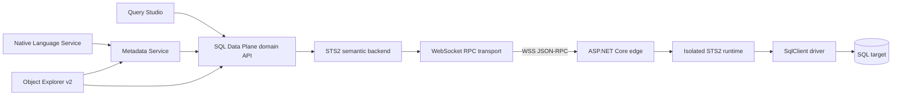
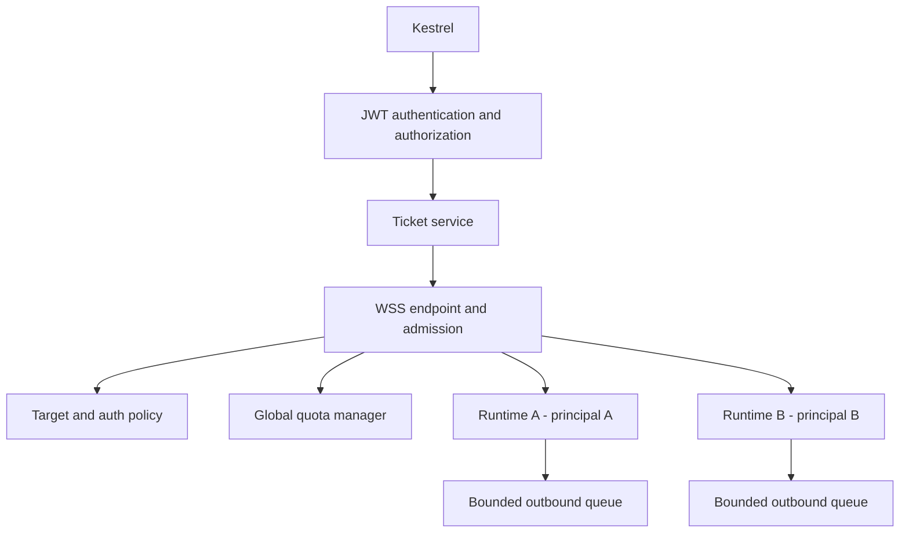

# Query Studio Web Backend: Portability Architecture and Implementation Plan

**Status:** Initial detailed design; code-inventory and cross-review pass complete, with implementation research decisions explicitly tracked  
**Date:** 2026-07-10  
**Code basis:** `sqltoolsservice` `dev/query` at `d9aca04ec8`, `vscode-mssql` `dev/query` at `1b977b6d4f`, and `perftest` `dev/query` at `5a51473f43`  
**Primary audience:** Query Studio, SQL Data Plane, STS v2, Metadata Service, native SQL Language Service, Object Explorer v2, security, and Azure hosting owners

## 1. Executive recommendation

Build a separate ASP.NET Core service, provisionally named
`Microsoft.SqlTools.Sts2.WebHost`, and expose the existing STS v2 semantic
contract as JSON-RPC 2.0 over one authenticated WebSocket. Do not build a new
query engine, do not host the legacy SQL Tools Service process inside ASP.NET,
and do not translate the protocol into a set of independent REST endpoints for
the first version.

The reusable boundary is:

- STS v2 Contracts, Core, Abstractions, Runtime, and Drivers.SqlClient;
- the SQL Data Plane domain contract in vscode-mssql;
- the existing `Sts2Backend` semantic adapter after its transport and lifecycle
  assumptions are parameterized;
- Query Studio execution, Metadata Service, and most OE v2 browsing code that
  already depends only on `ISqlConnectionService` / `ISqlSession`.

The new code is:

- an ASP.NET Core edge responsible for API authentication, WebSocket admission,
  tenancy, target policy, quotas, health, and shutdown;
- a transport-neutral STS v2 runtime-session factory and a WebSocket
  StreamJsonRpc binding;
- a browser-compatible WebSocket JSON-RPC client in vscode-mssql;
- an explicit backend factory and lifecycle owner in vscode-mssql;
- complete profile/auth mapping, including Entra token providers;
- portability policy that prevents target features from silently using STS v1;
- browser-host composition and storage/diagnostics adapters in a later milestone.

The recommended delivery order is intentionally split:

1. **Remote data-plane proof on VS Code desktop and a Codespaces remote Node
   extension host.** This proves that Query Studio execution, metadata, and OE v2
   can run without using the local STS v2 lane. It does not claim that the whole
   extension runs in a browser.
2. **Production-grade hosted STS v2.** Add Entra API authentication, OBO or
   managed-identity database authentication, target allowlists, multi-tenant
   quotas, lifecycle hardening, and Azure deployment.
3. **VS Code web extension slice.** Add a `browser` entry point and browser-safe
   implementations for results storage, metadata cache, diagnostics, profile
   composition, plans, and native language routing.

This split is important. `mssql.sqlDataPlane.backend` is currently a selector
for a small domain service, not a selector for every SQL feature in the
extension. A remote adapter alone does not make classic Query Runner, classic
Object Explorer, the STS v1 language client, Table Designer, Schema Compare,
Profiler, or the current extension activation graph portable.

## 2. Proposed decisions

The following are recommendations for the first reviewed implementation. Open
questions are collected in section 25.

| Area                     | Recommendation                                                                                                                          |
| ------------------------ | --------------------------------------------------------------------------------------------------------------------------------------- |
| Server framework         | ASP.NET Core Web API on the repository's current `net10.0`; no Razor UI is required.                                                    |
| Deployment unit          | Separate executable/project, not Kestrel co-hosted in legacy ServiceLayer.                                                              |
| Semantic implementation  | Reuse STS v2 Core/Runtime/SqlClient driver. Do not independently reimplement connection/query behavior.                                 |
| Primary transport        | JSON-RPC 2.0 over WSS, one JSON-RPC message per WebSocket message.                                                                      |
| Bootstrap                | Authenticated HTTPS `POST` creates a short-lived, single-use WebSocket ticket.                                                          |
| Session tenancy          | One STS v2 runtime per authenticated WebSocket. One socket may own multiple SQL sessions. Never share one Core state across principals. |
| Reconnect                | Transport reconnect is allowed; SQL sessions and queries are not resumed or silently replayed.                                          |
| Initial client           | VS Code desktop and remote Node extension host first; browser host is a distinct milestone.                                             |
| Hosted API auth          | Microsoft Entra protected API with a delegated scope; explicit loopback-only development auth for local tests.                          |
| SQL user delegation      | OBO is the recommended production mode when SQL must observe the end user.                                                              |
| SQL service identity     | Managed identity is the recommended mode when the service identity is sufficient.                                                       |
| Direct SQL token         | Supported as an early proof and explicit deployment mode, with token lifetime/pooling constraints.                                      |
| SQL Login                | Supported, but the hosted service becomes a trusted credential processor; require TLS, consent, redaction, and no persistence.          |
| Windows Integrated       | Unsupported remotely in v1. Do not substitute the web app process identity for the user.                                                |
| Target routing           | Server-owned route aliases or an exact target allowlist; never unrestricted user-controlled server/port in production.                  |
| On-premises reachability | App Service Hybrid Connections, VNet plus VPN/ExpressRoute, or a purpose-built Azure Relay agent. OPDG is not the transport.            |
| Azure Arc                | Management and identity enablement, not a SQL data tunnel. A normal TCP route is still required.                                        |
| Portable feature policy  | Add strict portability mode that disables STS v1 language fallback and OE v2 legacy handoffs and adds test tripwires.                   |
| Third-party dependencies | Reuse StreamJsonRpc and existing `vscode-jsonrpc`; add Microsoft.Identity.Web/MSAL only where needed. Avoid another RPC stack.          |

## 3. Goals and non-goals

### 3.1 Goals

1. Prove that new Query Studio execution uses a portable connection/query API,
   not a process-local SQL Tools Service assumption.
2. Route SQL Data Plane consumers through a remote backend selected by setting.
3. Preserve STS v2 ordering, terminality, cancellation, disposal, typed-cell,
   paging, and credit-backpressure semantics.
4. Support local SQL Server, Azure SQL Database, and explicitly configured
   private/on-premises SQL targets.
5. Support SQL Login and modern Entra authentication without putting secrets in
   settings, logs, journals, URLs, telemetry, or client status output.
6. Keep the service deployable as a single local process for development and as
   a horizontally managed Azure application for later scenarios.
7. Make tenant isolation, authorization, target policy, quotas, and cleanup
   first-class server responsibilities.
8. Preserve extension-host portability by keeping product features behind the
   SQL Data Plane and metadata/language provider interfaces.
9. Provide a staged path to a real VS Code web extension.
10. Add conformance and performance coverage so local stdio and hosted WSS
    bindings cannot drift semantically.

### 3.2 Non-goals for the first milestone

- Replacing every STS v1 feature in vscode-mssql.
- Making classic Query Runner or classic Object Explorer use the remote backend.
- Remotely hosting the existing STS v1 Language Service.
- Kerberos constrained delegation or Windows Integrated pass-through.
- Transparent failover/resume of a live `SqlConnection` or result stream.
- General-purpose arbitrary TCP proxying.
- Letting a workspace configure an unrestricted hosted endpoint or SQL target.
- Building a web management portal or MVC-rendered UI.
- Persisting SQL passwords or caller SQL access tokens in the web service.
- Treating OPDG or Azure Arc onboarding as an application data-path tunnel.

## 4. Terminology and trust boundaries

The word "session" is overloaded in the current code. This design uses:

| Term                 | Meaning                                                                                             |
| -------------------- | --------------------------------------------------------------------------------------------------- |
| Extension host       | The Node or browser worker process running vscode-mssql. In Codespaces this may be remote.          |
| Backend API session  | The authenticated WSS connection between one extension host and one WebHost instance.               |
| STS v2 runtime       | One isolated Core/Runtime/effect-runner instance owned by a backend API session.                    |
| SQL session          | One `ISqlSession`, STS v2 `connectionId`, and driver session/`SqlConnection`.                       |
| Query                | One accepted STS v2 `queryId` and its ordered result/message/terminal stream.                       |
| Backend API identity | The principal authorized to call the hosted WebHost.                                                |
| Database identity    | The SQL Login, delegated Entra user, or service identity used by `SqlConnection`.                   |
| Route alias          | A server-admin-defined logical target that resolves to an allowed SQL host/database policy.         |
| Portability mode     | Extension policy that forbids hidden use of local/classic service paths for the scoped feature set. |

There are two independent authentication hops:

```text
VS Code / vscode-mssql
  |  Hop A: authenticate to WebHost API
  |  Entra API token or explicit development credential
  v
STS v2 WebHost
  |  Hop B: authenticate to target SQL
  |  SQL Login, direct SQL token, OBO token, or managed identity
  v
SQL Server / Azure SQL
```

Passing Hop A does not authorize an arbitrary Hop B. The server must authorize
which target route and database-auth strategy a principal may request.

## 5. Code and document basis

This inventory was made against the three `dev/query` heads named at the top.
The changes relative to `main` are large: STS v2 adds its componentized runtime
and contract suite; vscode-mssql adds the SQL Data Plane, Query Studio,
Metadata Service, native language engine, OE v2, and results infrastructure;
perftest adds Query Studio scenarios and observability contracts.

Primary local design inputs:

- `coding-docs/ssms-query-docs/03-sts2-client-adapter-design.reviewed.md`
- `coding-docs/ssms-query-docs/04-query-studio-master-design.reviewed.md`
- `coding-docs/ssms-query-docs/02-metadata-service-design.reviewed.md`
- `coding-docs/language-service-docs/05-tsql-language-service-design.md`
- `coding-docs/oe-docs/metadata_service_oe_v2_design.md`
- `coding-docs/ssms-query-docs/query-studio-design-addendum.md`
- `sqltoolsservice/docs/sts2/SPEC.md`
- `sqltoolsservice/docs/sts2/CONTRACT.md`
- `sqltoolsservice/docs/sts2/COMPONENTS.md`
- `sqltoolsservice/docs/sts2/INVARIANTS.md`

The reviewed adapter design already states the key architectural intent: product
features import a connection/query domain API, while STS v2 stdio, future HTTP,
hosted REST, or another implementation are bindings. This proposal implements
that intent but recommends WSS instead of REST plus a second event channel.

## 6. Current architecture inventory

### 6.1 Product-side domain seam

`vscode-mssql/extensions/mssql/src/services/sqlDataPlane/api.ts` is the correct
feature boundary. It deliberately has no VS Code dependency and defines:

- `SqlConnectionProfileRef` with server/database/auth identity;
- `AuthProviderBundle` with deferred password and token providers;
- availability and negotiated `SqlBackendCapabilities`;
- `ISqlConnectionService.openSession` / `canOpen`;
- `ISqlSession.execute`, close, state changes, and database-context changes;
- ordered query sinks, handles, cancellation, completion, paging, typed cells,
  and acknowledgement behavior.

Important current lines:

| Code                                 | Current role                                                                         | Design impact                                                                                      |
| ------------------------------------ | ------------------------------------------------------------------------------------ | -------------------------------------------------------------------------------------------------- |
| `services/sqlDataPlane/api.ts:41-61` | Profile reference and deferred secrets/token providers.                              | Keep this semantic model, but add backend routing/security identity and browser-safe byte helpers. |
| `api.ts:67-96`                       | Capability model including streaming, backpressure, plans, compact rows, and resume. | Populate exclusively from the negotiated host result; do not hardcode unsupported capabilities.    |
| `api.ts:114-180`                     | Service/session contract.                                                            | Add service lifecycle/disposal and transport state without leaking WSS types.                      |
| `api.ts:233-241`                     | Query completion always settles.                                                     | Retain as a conformance requirement on transport loss and host shutdown.                           |

The seam is necessary but not sufficient. Current composition and several
consumers still reach classic controller/services around it.

### 6.2 Current local STS v2 binding

`services/sqlDataPlane/sqlDataPlaneService.ts` is a singleton composition root.
`ServiceClientRpc` wraps the classic `SqlToolsServiceClient`, which uses the
existing vscode-languageclient over the shared stdio multiplexer. `Sts2Backend`
then maps the domain API to `v2/*` DTOs.

Current path:

```text
Query Studio / Metadata / OE v2
  -> ISqlConnectionService
  -> Sts2Backend
  -> ServiceClientRpc
  -> SqlToolsServiceClient / vscode-languageclient
  -> shared STS stdio
  -> StdioMultiplexer v2 lane
  -> Sts2Session
  -> Core / Runtime / SqlClient driver
```

The following are current composition limitations:

- `sqlDataPlaneService.ts:65-98` caches one backend forever.
- Only `fake` is recognized explicitly; any other setting silently becomes the
  local STS2 backend.
- Concurrent calls can start duplicate backends because there is no single-flight
  startup promise.
- A failed/unavailable backend remains cached and has no retry/reset path.
- configuration changes do not dispose or recompose it;
- `enabled` is not enforced by `service()` itself;
- extension deactivation does not close the data plane;
- `ServiceClientRpc` cannot observe transport close/error and its notification
  disposal is a no-op.

`Sts2Backend` already performs most of the semantic work worth reusing:

- maps SQL Login to `sqlLogin` and AAD/bearer to `accessToken`
  (`sts2Backend.ts:347-377`);
- negotiates initialization and capabilities;
- maps connection/session information;
- routes ordered result-set, page, message, and terminal notifications;
- maintains ack credit and one terminal result;
- synthesizes `connectionLost` on a known fatal;
- keeps wire DTO imports inside the STS2 binding.

It still has transport assumptions that must be removed:

- `backendInfo` and several diagnostics/error strings are hard-coded as
  `sts2-jsonrpc` (`sts2Backend.ts:171-190` and later call sites);
- `Sts2Rpc` has only request, void notification, and notification subscription
  (`sts2Backend.ts:78-82`), with no connect/close/error/backpressure lifecycle;
- initialization has no deadline;
- `canOpen` ignores requested capabilities;
- incoming DTOs are unchecked TypeScript casts;
- the unknown-query `orphanBuffer` is unbounded and has no TTL;
- ack is fire-and-forget, so failed delivery is invisible;
- query acceptance has no deadline or client execute ID;
- capture/replay capabilities are currently hard-coded more optimistically than
  their exposed implementation;
- remote paths and remote error strings are not sanitized for a lower-trust host.

### 6.3 STS v2 component boundary

STS v2 is already organized so most of it can be reused:

| Project                                     | Responsibility                                                                    | WebHost treatment                                                          |
| ------------------------------------------- | --------------------------------------------------------------------------------- | -------------------------------------------------------------------------- |
| `Microsoft.SqlTools.Sts2.Contracts`         | Method/error constants, defaults, and method metadata; no typed wire DTO set.     | Reuse; add explicit validators/schemas as new work.                        |
| `Microsoft.SqlTools.Sts2.Core`              | Deterministic state reducer; no I/O, time, async, driver, or StreamJsonRpc.       | Reuse after long-lived-session fixes.                                      |
| `Microsoft.SqlTools.Sts2.Abstractions`      | Driver/session/query ports and events.                                            | Reuse.                                                                     |
| `Microsoft.SqlTools.Sts2.Runtime`           | Coordinator, effects, redaction, secret side table, journal, replay, diagnostics. | Reuse, but add host-policy and bounded lifecycle abstractions.             |
| `Microsoft.SqlTools.Sts2.Drivers.SqlClient` | Microsoft.Data.SqlClient implementation.                                          | Reuse; extend token callback/host-delegated auth support.                  |
| `Microsoft.SqlTools.Sts2.Hosting`           | Currently creates HeaderDelimited StreamJsonRpc and the gateway.                  | Refactor into transport-neutral runtime plus stdio and WebSocket adapters. |
| `Microsoft.SqlTools.Sts2.Multiplexer`       | Routes v1/v2 over process stdio.                                                  | Keep unchanged for local STS; do not use in WebHost.                       |
| `Microsoft.SqlTools.Sts2.Bootstrap`         | Composes the one process-wide stdio session.                                      | Keep for ServiceLayer; do not use in WebHost.                              |
| `Microsoft.SqlTools.Sts2.Testing`           | Fake driver, simulator, scenarios, invariant tests.                               | Reuse for binding conformance.                                             |

Today `Sts2SessionOptions` requires input and output `Stream`s and
`Sts2Session.Start` constructs a `HeaderDelimitedMessageHandler`, `JsonRpc`, the
private `GatewayTarget`, coordinator, journal, secret side table, and effect
runner (`Sts2Session.cs:27-184`). Behind the gateway, coordinator inputs and
`OutboundRpcMessage` values are already transport-neutral.

The repository-pinned StreamJsonRpc `2.25.28` exposes
`IJsonRpcMessageHandler` but does not contain the
[`WebSocketMessageHandler` available in newer StreamJsonRpc APIs](https://microsoft.github.io/vs-streamjsonrpc/docs/extensibility.html).
Implement a small handler at the pinned version that maps one JSON-RPC value to
one WebSocket message, or make a package upgrade an explicit dependency/review
decision. Do not put stdio `Content-Length` framing inside the socket. Let the
hosting/session factory accept the handler while retaining the gateway's
redaction, pending-correlation, error mapping, and fatal behavior. A controller
must not post directly to `Coordinator`; that would duplicate or bypass those
guarantees.

Even the newer stock handler treats its buffer size as a hint, supports larger
messages, and does not own disposal of the supplied socket. The WebHost handler
must enforce inbound and final outbound UTF-8 limits for both JSON-RPC responses
and Core notifications. The endpoint explicitly owns close/abort/disposal.

### 6.4 STS v2 wire behavior that must remain portable

The WebHost binding must preserve these current `v2/*` methods and events:

```text
v2/initialize
v2/connection.open
v2/connection.cancel
v2/connection.close
v2/query.execute
v2/query.cancel
v2/query.dispose
v2/query.ack
v2/diagnostics.ping
v2/diagnostics.health
v2/diagnostics.state
v2/diagnostics.exportLog
v2/diagnostics.setCapture

v2/query.resultSet       server notification
v2/query.rows            server notification
v2/query.message         server notification
v2/query.complete        server notification
```

`v2/fatal` is currently synthesized by `StdioMultiplexer.MarkSts2Dead`, not
emitted by Hosting/Core. WebHost does not inherit that behavior. The MVP should
use a sanitized WebSocket close plus transport-loss handling, or add a new
journaled/registered WebHost fatal contract. Never forward the current raw
reason/journal-path payload remotely.

Portable semantics include:

- exactly one terminal per accepted query;
- result-set metadata before its pages;
- ordered pages/messages/terminal;
- no result events after the terminal;
- one active query per SQL session;
- four-page credit window and cumulative per-query ack ordinal;
- page row/byte and cell byte limits;
- compact and legacy page shapes;
- typed wrappers for lossy values;
- bounded cancel/dispose/close behavior;
- secrets redacted before coordinator/journal ingress;
- digest capture as the default;
- stable error identities, not string matching as the product contract.

The current `initialize` implementation is idempotent but is not yet a security
or protocol admission gate: it ignores `clientName`, requested version, and
client capabilities, and other methods can run before initialization. Web
hosting must validate/authorize at the edge and should make successful compatible
initialization mandatory before connection/query/diagnostic methods.

The current defaults include 1,000 rows/page, approximately 256 KiB/page, four
unacknowledged pages, 1 MiB/cell, 64 MiB/frame, and 64 connections per Core
state (`Sts2Defaults.cs`). WebHost must advertise the effective lower of STS v2
limits and host/operator limits.

### 6.5 Feature portability matrix

| Feature area                                            | Current data source                                                                                              | Remote data-plane readiness         | Remaining work                                                                                               |
| ------------------------------------------------------- | ---------------------------------------------------------------------------------------------------------------- | ----------------------------------- | ------------------------------------------------------------------------------------------------------------ |
| Query Studio execute/cancel/stream results              | `ISqlSession` through `executionOrchestrator.ts:116-127,502-518`                                                 | High on desktop.                    | Inject composition; populate capabilities; harden loss/reconnect; web RowStore later.                        |
| Query Studio connection selection                       | Saved classic ConnectionStore reached through `mssql.getControllerForTests` in `documentSessionBinding.ts:58-63` | Medium.                             | Inject profile repository and auth resolver; support Entra mapping; remove static controller seam.           |
| Query Studio language                                   | Native engine plus default STS v1 bridge                                                                         | Low under strict portability today. | Force native and disable hidden bridge fallback, or separately design a remote LS API.                       |
| Query Studio metadata                                   | MetadataStore -> SQL Data Plane catalog SQL                                                                      | High semantically.                  | Cap hydration; cancel watchdog-expired queries; partition cache by backend/principal; browser cache adapter. |
| Query Studio results storage                            | Node fs/path/Buffer spill RowStore                                                                               | Desktop only.                       | Storage abstraction; memory-only browser MVP; later IndexedDB/OPFS if required.                              |
| Query Studio export                                     | Node fs/os/path and fsPath                                                                                       | Desktop only.                       | Capped browser write or separate streaming design; gate by extension-host capability.                        |
| Execution plan graph                                    | Query execution is data-plane; plan parsing/opening calls classic service                                        | Partial.                            | JS parser or negotiated remote plan-parse endpoint; gate graph until implemented.                            |
| OE v2 browse                                            | Injected SQL Data Plane session + shared MetadataStore                                                           | High below activation.              | Inject factory/profile sources; coordinate transport loss; explicit remote-connect consent.                  |
| OE v2 native scripting/preview                          | Metadata/data-plane native                                                                                       | Medium/high.                        | Audit every command and capability-gate.                                                                     |
| OE v2 backup/restore/profiler/schema compare/edit table | Explicit classic handoff                                                                                         | Not portable.                       | Hide/disable in strict/web mode or port each feature independently.                                          |
| Native SQL language core                                | TypeScript core + catalog provider                                                                               | Conceptually portable.              | Browser diagnostics/runtime split; browser composition; no STS bridge fallback.                              |
| Classic Query Runner/Object Explorer/Language Client    | STS v1                                                                                                           | Not portable.                       | Out of first scope.                                                                                          |
| Metadata persistent cache                               | Node crypto/zlib/fs                                                                                              | Desktop only.                       | Inject cache/crypto/compression adapters or initially disable in web.                                        |
| Pinned results/query-results shared access              | Extension-local result stores                                                                                    | Desktop only until storage port.    | Preserve local ownership; no need to send stored results to WebHost.                                         |
| Diagnostics/debug console                               | Node clocks/crypto/process/fs/http and local STS diag loopback                                                   | Not web-ready.                      | Portable diagnostics core plus Node/browser sinks; authenticated remote diagnostics policy.                  |

### 6.6 Query Studio bypasses that need explicit treatment

1. `documentSessionBinding.ts` obtains `MainController` through the
   `mssql.getControllerForTests` command to read profiles/secrets. This is a test
   seam being used as production composition. Replace it with injected
   `IConnectionProfileRepository` and `IConnectionAuthResolver`.
2. `queryStudioLanguageService.ts:93-98` reaches the classic connection manager,
   the setting defaults to `sqlToolsService`, and
   `sqlLanguage/host/router.ts:141-177` can route a failed native request back to
   the bridge. A remote data plane does not affect this path.
3. `queryStudioController.ts:319-341,695-766` reaches classic execution plan
   services. Plan rendering needs an explicit portable implementation or an
   honest unavailable state.
4. `rowStore.ts`, `resultExport.ts`, and related shared query-results code import
   Node `fs`, `path`, `os`, `crypto`, and `Buffer`.
5. Query Studio capability state is currently not populated from the actual
   backend. SQL actions must use negotiated backend/session capabilities, while
   plan parsing/export/spill/pinned-result actions use a separate extension-host
   capability aggregate.

### 6.7 Metadata and OE v2 details

MetadataService is well-positioned: its engines execute catalog SQL through an
injected `ISqlConnectionService`, and MetadataStore is keyed around prepared
connections. However:

- `profileAuthAdapter.ts:51-87` maps only values containing `integrated` to
  integrated; every other authentication type becomes SQL Login. Although the
  domain API and `Sts2Backend` support token providers, production composition
  never supplies one.
- `profileFingerprint.ts:41-60` keys server/user/auth/encryption but does not
  include backend deployment/routing realm or Entra tenant/account identity.
  Switching between local and remote endpoints can therefore cross-contaminate
  metadata cache identity.
- `MetadataStore` keys are essentially `serverFingerprint|database`.
- `metadataService.ts:391-419` accumulates metadata rows without a total
  row/byte cap. The watchdog marks a session wedged but does not immediately
  cancel/dispose the abandoned remote query.
- the cache composition hardcodes Node filesystem/compression/crypto adapters.

OE v2 already injects SQL sessions in `oeV2SessionRegistry.ts:50-155` and shares
MetadataStore. Its activation still obtains the static service/cache and classic
profiles, and its explicit legacy handoff creates a classic STS connection for
backup, restore, profiler, schema compare, and edit-table operations. Those
commands must be absent or explicitly unavailable under strict portability.
Remote mode also needs an explicit disclosure before tree expansion transmits a
saved target and credential to a hosted operator.

## 7. Findings that block a remotely reachable host

The current code was designed for a trusted process-local client. The following
must be fixed or resolved before exposing it across a trust boundary.

### 7.1 P0 correctness and privacy findings

1. **Successful `openId` reuse can alias live driver handles.** Core removes
   `OpenIdToConnectionId` after a successful open
   (`Sts2CoreReducer.cs:922-927`), while `DriverEffectRunner` creates handle ID
   `h-<openId>` (`DriverEffectRunner.cs:307`). Reusing a successful `openId` can
   overwrite a live handle while Core retains multiple connection records. Key
   the internal handle by `connectionId` or another runtime-generated unique ID,
   never client `openId`. If completed open IDs need duplicate semantics, retain
   only a bounded replay-deterministic tombstone set; do not reserve every value
   for the runtime lifetime.
2. **Completed and disposed query records are retained indefinitely.** No code
   removes terminal queries from `CoreState.Queries`; dispose only changes phase
   to `Disposed` (`Sts2CoreReducer.cs:630-672`). A long-lived WebSocket can grow
   state without bound. Because unknown cancel/dispose already returns `{}`,
   deterministic removal after resource release may preserve wire idempotency.
   Any tombstone/cache that remains must be count-bounded and replay-deterministic.
3. **Compact row capture bypasses digest elision.** `CaptureElision` replaces only
   top-level `rows` (`CaptureElision.cs:49-75`), while compact pages carry cells
   under `compact.values`. Digest-mode journals can therefore capture result
   values when compact rows are negotiated. Protect the entire value-bearing
   compact payload, including `values` and `nullBitmap`, and add value/null-pattern
   privacy canaries before remote use.
4. **Clean transport completion is not guaranteed to dispose the runtime.** The
   current session observes faults, while WebHost must always dispose in the
   WebSocket endpoint's `finally` path. Disconnect must cancel/await every open,
   query pump, and SQL session.
5. **Leaked-session disposal does not await every background open/query task.**
   `DriverEffectRunner.DisposeLeakedSessionsAsync` cancels work but does not
   await the same barriers used by explicit query disposal. Fix before
   high-churn hosted sessions.
6. **A local timeout does not cancel the underlying RPC.** The extension's
   `withDeadline` races a Promise but does not abort/remove the transport request.
   A timed-out remote `connection.open` can leave its password/token payload in
   a pending/queued request. Add `AbortSignal`/local JSON-RPC cancellation to
   delete pending payloads/IDs on abort and clear them on close, but do not treat
   transport cancellation as the durable STS operation cancel. A timed-out open
   must also send journaled `v2/connection.cancel(openId)`; pre-accept query
   cancellation needs a specified `executeId` state machine in Core.
7. **Active query dispose can wait forever.** The explicit effect-runner dispose
   path awaits the query pump task without a timeout, potentially retaining
   `ActiveQueryId` and parking a connection close forever. Define a bounded stop,
   forced connection/session abort, exactly-one terminal outcome, and journaled
   timeout/error behavior.

### 7.2 P0 isolation and admission findings

1. Core state contains global connection/query maps with predictable IDs and no
   principal ownership. `Coordinator` accepts an optional session ID, but the
   gateway does not provide it and Core does not namespace by it. Sharing one
   runtime would allow cross-caller cancel/close/diagnostic disclosure.
   **Required decision:** one runtime per authenticated WebSocket.
2. The current per-Core `MaxConnections=64` is not a process-wide limit. A web
   host needs global and per-principal socket, session, query, memory, and
   journal admission controls.
3. The current run ID is timestamp-to-second plus process ID. Multiple sessions
   in one process can collide while journal files use `CreateNew`. Use an opaque
   random session/run ID and a separate directory per runtime.
4. The coordinator outbound callback is synchronous, and callback failures are
   swallowed as dropped emissions. The current RPC path also fire-and-forgets
   notification writes. A hosted binding requires a bounded FIFO single-writer
   queue. Overflow or send failure must terminate only that tenant session in a
   deterministic way.
5. The extension `orphanBuffer` is unbounded by count, bytes, and age. A remote
   peer can cause a client memory denial of service with unknown query IDs.

### 7.3 Protocol/lifecycle findings

- The advertised 64 MiB frame limit is not an end-to-end WebSocket bound. The
  WebHost must reject oversized uncompressed UTF-8 messages and bound outbound
  serialization before send.
- REST commands plus a separate event connection create an execute-response vs
  first-result ordering race. One WSS transport removes the cross-connection
  race but does not automatically order independently serialized StreamJsonRpc
  responses and notifications. Add one application response/event sequencer,
  gate query notifications until the execute response is committed, or echo
  `executeId` on the result and every early notification. Keep the client orphan
  buffer as a bounded defensive race handler.
- STS v2 has no page payload replay store. An SSE reconnect cannot resume result
  notifications from the journal because digest capture intentionally omits
  cells. Socket death therefore means SQL session/query loss in v1.
- Mutating operations are not generally HTTP-idempotent. Query execute has no
  idempotency key, and duplicate open behavior is not a response cache. Generic
  HTTP retry middleware would be unsafe.
- initialization and query acceptance need client deadlines; cancellation before
  the server assigns a `queryId` needs an `executeId`/cancel-open equivalent.
- every sink callback needs bounded containment. A hung `onRowsPage` stalls the
  ordered lane and credit, while a later cancel/terminal waits behind it. Settle
  the handle's completion independently, then invoke the terminal sink callback
  best-effort within a deadline.
- diagnostics capabilities are not host-aware. `exportLog` returns a server
  filesystem path, and `state`, capture changes, and export are inappropriate
  for ordinary remote principals.
- no current component owns graceful web-host drain: stop admission, close
  tickets, notify/fail sockets, cancel work, flush bounded journals, and exit.
- compact `encodedBytes` currently uses UTF-16 `string.Length`; page bytes are
  approximate; one row may exceed the page limit; provider-specific objects can
  bypass `maxCellBytes`; and there is no final UTF-8 frame guard. Define a stable
  pre-send query failure/truncation identity rather than discovering oversize by
  dropping the whole socket.
- clean `Sts2Session.DisposeAsync` does not fail every pending request TCS or
  clear all request-scoped secrets. The new stop sequence must stop intake, fail
  pending RPCs, clear secrets, cancel and await effects, drain/flush the
  coordinator, and only then close transport resources.

## 8. Architecture options considered

### 8.1 Option A: independently implement REST connection/query endpoints

**Shape:** ASP.NET controllers implement connect, execute, poll/stream rows,
cancel, and close directly over SqlClient.

**Advantages**

- Familiar HTTP APIs and easy manual inspection.
- Could optimize specifically for browser request/response behavior.
- No dependency on STS v2 Hosting.

**Disadvantages**

- Duplicates the hardest semantics: ordered multi-result streaming, exactly-one
  terminal, cancel/dispose races, typed values, page limits, backpressure,
  error mapping, redaction, and replay/diagnostics.
- Creates a second contract/conformance burden and undermines the isolation test.
- REST plus SSE needs session registry, event ordering, auth on both channels,
  replay policy, idempotency policy, and client-operation correlation.
- Drift is likely as STS v2 evolves.

**Decision:** Reject for the initial implementation. A future REST facade can
wrap the same runtime if a concrete consumer requires it, but must have its own
complete protocol specification and conformance suite.

### 8.2 Option B: run the full legacy SQL Tools Service behind ASP.NET

**Shape:** The web app starts or embeds ServiceLayer and proxies its existing
stdio JSON-RPC.

**Advantages**

- Broad classic feature coverage in theory.
- Less immediate extension feature gating.

**Disadvantages**

- Preserves process/stdin/global-singleton assumptions that the new architecture
  is intended to eliminate.
- Makes tenant isolation, resource accounting, secrets, process lifecycle, and
  arbitrary legacy endpoint exposure much harder.
- Pulls unrelated services and native/deployment dependencies into the web app.
- Does not prove that Query Studio is isolated behind the new domain seam.

**Decision:** Reject. Keep legacy ServiceLayer local and separately port only
features with explicit portable contracts.

### 8.3 Option C: reuse STS v2 runtime over WebSocket

**Shape:** ASP.NET authenticates/upgrades WSS, creates one STS v2 runtime, and
binds a small `IJsonRpcMessageHandler` WebSocket implementation to the existing
gateway. Upgrading StreamJsonRpc to a version with its built-in WebSocket handler
is an alternative after dependency/API/reliability review.

**Advantages**

- Reuses the intended semantic contract and extensive state/scenario tests.
- Full-duplex channel matches query notifications and acks; an application
  sequencer preserves response/notification commit ordering.
- Minimal new client dependencies; existing `Sts2Backend` remains the semantic
  adapter.
- Keeps ASP.NET concerns at the edge and SQL concerns in the existing driver.
- Directly validates the extension portability boundary.

**Disadvantages**

- Requires lifecycle, tenancy, quota, token, and long-lived-session hardening.
- WebSocket deployments need explicit drain/reconnect/affinity operations.
- Browser WebSocket authentication needs a bootstrap ticket/cookie pattern.

**Decision:** Recommend.

### 8.4 Option D: REST control plus WebSocket or SSE events

This was reserved in prior designs and remains possible, but it is not the
smallest correct binding. It introduces two-channel ordering, event replay,
mutation retry, and session-registry complexity. Use it only after a concrete
platform constraint proves full-duplex WSS unusable. Native browser `EventSource`
also cannot set an Authorization header, so bearer-secured SSE would require a
fetch-streaming client or a cookie/ticket design anyway.

### 8.5 Why not gRPC-Web or SignalR first

- gRPC-Web does not provide the same simple browser bidirectional streaming
  shape without additional infrastructure and a second contract stack.
- SignalR would add hub framing and client/server dependencies around an already
  defined JSON-RPC protocol.
- raw WebSocket can be integrated through StreamJsonRpc's existing message-handler
  abstraction, and `vscode-jsonrpc` has browser-compatible primitives on the
  client.

These can be revisited if platform telemetry demonstrates a material need.

## 9. Target architecture



The SQL Data Plane remains the only connection/query dependency of the scoped
extension features. `Sts2Backend` remains responsible for translating between
that domain and STS v2 wire DTOs. Transport is below it. Authentication to the
WebHost is below/alongside transport and does not leak into feature APIs.

### 9.1 Server process topology



One WebSocket owns exactly one runtime. The runtime may open multiple SQL
connections for Query Studio, metadata, and OE v2, but cannot see another
socket's IDs, events, state, secrets, or journals. Process-wide quota and target
policy live outside the runtime so opening more sockets cannot bypass them.

### 9.2 Proposed solution/project layout

```text
sqltoolsservice/src/sts2/
  Microsoft.SqlTools.Sts2.Hosting/
    Sts2RuntimeSession.cs           transport-neutral gateway/runtime owner
    Sts2RuntimeSessionOptions.cs
    StdioSts2RpcHost.cs             current HeaderDelimited adapter
    WebSocketSts2RpcHost.cs         optional generic adapter, no ASP.NET refs

  Microsoft.SqlTools.Sts2.WebHost/
    Program.cs
    Authentication/
      WebSocketTicketService.cs
      BackendPrincipal.cs
    Endpoints/
      InfoEndpoint.cs
      TicketEndpoint.cs
      RpcWebSocketEndpoint.cs
      HealthEndpoints.cs
    Hosting/
      Sts2WebSessionFactory.cs
      Sts2WebSessionRegistry.cs
      GracefulDrainService.cs
    Policy/
      SqlTargetPolicy.cs
      DatabaseAuthPolicy.cs
      WebHostLimits.cs
      AdmissionController.cs
    Observability/
      WebHostTelemetry.cs
      RemoteDiagnosticsPolicy.cs
    appsettings.json

sqltoolsservice/test/sts2/
  Microsoft.SqlTools.Sts2.WebHost.UnitTests/
  Microsoft.SqlTools.Sts2.WebHost.E2ETests/
```

Use `Microsoft.NET.Sdk.Web` for the edge project. Reference Hosting, Contracts,
and Drivers.SqlClient. Do not reference ServiceLayer, Bootstrap, Multiplexer, or
the legacy host. Add the new dependency edges to architecture matrix tests and
component documentation.

### 9.3 Hosting refactor boundary

Extract a transport-neutral `Sts2RuntimeSession` that owns:

- `GatewayTarget` request mapping;
- secret redaction before coordinator ingress;
- pending request correlation and stable error translation;
- coordinator, Core state, effect runner, driver registry, journal and sinks;
- outbound notification callback/queue contract;
- fatal and completion state;
- deterministic async disposal.

Then bind it in one of two ways:

1. Existing stdio startup supplies `HeaderDelimitedMessageHandler` and retains
   multiplexer behavior.
2. WebHost supplies the custom WebSocket `IJsonRpcMessageHandler` after
   authentication/admission (or the reviewed upgraded built-in handler).

An alternate, smaller first refactor is for `Sts2Session.Start` to accept an
`IJsonRpcMessageHandler` instead of streams and move only handler construction
to callers. The deeper runtime extraction is preferable if it also fixes clean
completion, bounded outbound delivery, async session creation, and host policy.

### 9.4 WebHost service seams

Keep ASP.NET controllers/endpoints thin. Suggested server-owned interfaces:

```csharp
public interface IWebSocketTicketService
{
    ValueTask<IssuedTicket> IssueAsync(BackendPrincipal principal,
        TicketRequest request, CancellationToken cancellationToken);
    ValueTask<RedeemedTicket?> RedeemAsync(string opaqueTicket,
        WebSocketRequestFacts request, CancellationToken cancellationToken);
}

public interface IBackendAuthorizationService
{
    ValueTask<BackendGrant> AuthorizeSessionAsync(
        ClaimsPrincipal principal, CancellationToken cancellationToken);
}

public interface ISqlTargetPolicy
{
    ValueTask<AuthorizedSqlTarget> AuthorizeAsync(
        BackendGrant grant, RequestedSqlTarget target,
        RequestedDatabaseAuth auth, CancellationToken cancellationToken);
}

public interface ISts2WebSessionFactory
{
    ValueTask<ISts2WebSession> CreateAsync(
        RedeemedTicket ticket, WebSocket socket,
        CancellationToken cancellationToken);
}
```

Also isolate `IGlobalAdmissionController`, `IHostSqlTokenProvider`,
`IRemoteDiagnosticsPolicy`, and journal storage/retention behind interfaces so
local development, App Service, and tests do not require the same infrastructure.

Composition sketch, deliberately omitting deployment-specific details:

```csharp
var builder = WebApplication.CreateBuilder(args);
builder.Services.AddAuthentication().AddMicrosoftIdentityWebApi(...);
builder.Services.AddAuthorization(...);
builder.Services.AddRateLimiter(...);
builder.Services.AddSingleton<IWebSocketTicketService, WebSocketTicketService>();
builder.Services.AddSingleton<IGlobalAdmissionController, AdmissionController>();
builder.Services.AddSingleton<ISqlTargetPolicy, ConfiguredSqlTargetPolicy>();
builder.Services.AddSingleton<ISts2WebSessionFactory, Sts2WebSessionFactory>();
builder.Services.AddHostedService<GracefulDrainService>();

var app = builder.Build();
app.UseExceptionHandler(...);
app.UseHttpsRedirection();
app.UseCors("ticketOrigins");
app.UseAuthentication();
app.UseAuthorization();
app.UseRateLimiter();
app.UseWebSockets(webSocketOptions);

app.MapGet("/health/live", ...);
app.MapGet("/health/ready", ...);
app.MapGet("/api/sts2/v1/info", ...);
app.MapPost("/api/sts2/v1/tickets", ...).RequireAuthorization("connect");
app.Map("/api/sts2/v1/rpc", RunWebSocketSessionAsync);
await app.RunAsync();
```

`RunWebSocketSessionAsync` must await the JSON-RPC/socket lifetime inside the
request pipeline and dispose the runtime in `finally`. Do not enqueue the socket
to an untracked background task and let the request return.

### 9.5 Configuration model

Configuration contains policy, not caller credentials:

```json
{
  "Sts2WebHost": {
    "PublicOrigin": "https://query-backend.example.com",
    "AllowedBrowserOrigins": ["https://vscode.dev"],
    "Authentication": {
      "Mode": "Entra",
      "AllowedTenants": ["<tenant-id>"],
      "RequiredScope": "QueryStudio.Connect"
    },
    "Limits": {
      "MaxSocketsPerPrincipal": 2,
      "MaxSqlSessionsPerSocket": 8,
      "MaxActiveQueriesPerPrincipal": 8,
      "MaxInboundMessageBytes": 8388608,
      "MaxOutboundMessageBytes": 8388608,
      "IdleSocketSeconds": 900,
      "AbsoluteSocketSeconds": 28800
    },
    "Routes": {
      "dev-sql": {
        "Server": "sql.internal.example,1433",
        "AllowedDatabases": ["sample"],
        "RequiredEncrypt": true,
        "AllowedAuth": ["entraOBO", "managedIdentity"]
      }
    },
    "Journal": {
      "Mode": "off",
      "MaxBytesPerRun": 16777216,
      "RetentionMinutes": 60
    }
  }
}
```

This is illustrative, not a final settings schema. App credentials, Key Vault
references, development API keys, and token-cache encryption keys belong in
managed secret/configuration providers. Reject unknown/invalid configuration at
startup. Never print the effective secret configuration in diagnostics.

## 10. WebHost HTTP and WebSocket contract

Version the HTTP edge independently from the STS v2 spec. Proposed base path:
`/api/sts2/v1`.

### 10.1 Endpoints

| Method/path                           | Auth                                     | Purpose                                                                                         |
| ------------------------------------- | ---------------------------------------- | ----------------------------------------------------------------------------------------------- |
| `GET /health/live`                    | Platform policy                          | Process liveness only. No SQL probe.                                                            |
| `GET /health/ready`                   | Platform policy                          | Ready to authenticate/admit new sockets. No arbitrary target probe.                             |
| `GET /api/sts2/v1/info`               | Unauthenticated, rate-limited            | Non-sensitive auth discovery, edge/spec versions, public limits, deployment/cache partition ID. |
| `POST /api/sts2/v1/tickets`           | Entra bearer or explicit dev auth        | Mint one short-lived, single-use WSS ticket for the current principal.                          |
| `WS /api/sts2/v1/rpc?ticket=<opaque>` | Single-use ticket + browser Origin + WSS | Upgrade (HTTP/1.1 GET or HTTP/2 CONNECT as supported) and run JSON-RPC.                         |

Do not add connect/query REST endpoints in v1. Do not expose journal filesystem
paths. If an administrator later needs diagnostic export, provide a separate
authorized HTTPS download that streams a sanitized bundle and has its own
retention/audit policy.

### 10.2 Info response sketch

```json
{
  "edgeApiVersion": "1.0",
  "sts2SpecVersions": ["2.0"],
  "webSocketSubprotocol": "mssql.sts2.jsonrpc.v1",
  "authentication": {
    "mode": "entraBearerTicket",
    "authority": "https://login.microsoftonline.com/organizations",
    "clientId": "<public-webhost-api-app-id>",
    "scope": "api://<app-id>/QueryStudio.Connect"
  },
  "deploymentId": "dp_<non-secret-stable-id>",
  "limits": {
    "maxInboundMessageBytes": 8388608,
    "maxOutboundMessageBytes": 8388608,
    "maxSqlSessionsPerSocket": 8,
    "idleSocketSeconds": 900,
    "absoluteSocketSeconds": 28800
  }
}
```

`deploymentId` is a non-secret cache/routing partition, not a hostname. It must
change when target routing or authorization semantics change enough that cached
metadata should not be shared.

Keep `/info` unauthenticated and cacheable because it supplies the audience/scope
needed to obtain the first API token. Publish only non-sensitive deployment
metadata. An enterprise deployment may instead require a complete machine/admin
profile, but must not require an authenticated discovery call whose token
parameters are available only in that response.

### 10.3 Ticket request/response

The [browser WebSocket constructor](https://developer.mozilla.org/en-US/docs/Web/API/WebSocket/WebSocket)
accepts only URL and subprotocol, not an arbitrary Authorization header. The
extension can use `fetch` with a bearer token to create a short-lived ticket,
then use that opaque ticket in the WSS upgrade URL.

```http
POST /api/sts2/v1/tickets
Authorization: Bearer <token-for-webhost-api>
Content-Type: application/json

{
  "client": "vscode-mssql",
  "clientVersion": "<extension-version>",
  "requestedSpecVersion": "2.0"
}
```

```json
{
  "ticket": "<256-bit-opaque-value>",
  "expiresAt": "2026-07-10T12:34:56Z",
  "webSocketUrl": "wss://example/api/sts2/v1/rpc",
  "subprotocol": "mssql.sts2.jsonrpc.v1"
}
```

Ticket requirements:

- 30-60 second lifetime;
- cryptographically random or protected, never a reusable API token, and treated
  as a secret in client/proxy/server status and telemetry;
- single use with atomic redemption;
- associated server-side with principal, tenant, deployment, requested
  subprotocol, and expected Origin for browser clients; a reviewed desktop
  client class may explicitly allow an absent Origin without treating Origin as
  authentication;
- stored only as a hash if server-side storage is used;
- query strings scrubbed from reverse-proxy/Kestrel access logs;
- ticket responses send `Cache-Control: no-store` and are never cached by a
  service worker/proxy;
- rejected after drain starts;
- no SQL target or database credential embedded in the ticket.

The MVP ticket is a bearer credential: a thief who obtains it before redemption
can redeem as its associated principal. Principal/Origin metadata does not prove
possession. Short TTL, single use, TLS, strict logging, and browser Origin checks
reduce exposure. If the threat model requires stronger theft resistance, add a
separately presented PKCE/DPoP-style proof or a secure authenticated cookie and
specify it before implementation.

Define three Origin cases explicitly: browser clients require an exact allowed
Origin; Node clients that send Origin must match their declared client policy;
approved Node clients may omit Origin. Origin is forgeable outside a browser and
is only a cross-site WebSocket-hijacking defense, never caller authentication.

Rate-limit issuance, but acquire socket/principal quota atomically at ticket
redemption. Reserving full socket quota at issuance lets abandoned tickets hold
capacity; checking only non-atomically at redemption races concurrent upgrades.
If short-lived reservations are used instead, specify guaranteed expiry/release.

A same-site secure cookie is another viable browser mechanism, but the ticket
model is more explicit for VS Code desktop, Codespaces, and browser origins and
avoids relying on third-party cookie behavior.

### 10.4 WebSocket framing

- Require TLS except for an explicit loopback-only development mode.
- Require subprotocol `mssql.sts2.jsonrpc.v1`.
- One text WebSocket message contains one UTF-8 JSON-RPC message.
- Do not put `Content-Length` headers inside WebSocket messages.
- Reject binary messages initially.
- Reassemble fragmented WebSocket messages only up to the configured
  uncompressed size; close with 1009 on oversize.
- Close with a protocol error for malformed JSON-RPC/DTOs.
- Reject JSON-RPC batch arrays in v1 unless ordering/admission semantics are
  separately specified and tested.
- Disable per-message compression initially because it complicates size
  accounting and secret/compression threat analysis.
- Enforce one async single writer per socket.

Define keepalive at two layers: server WebSocket ping/pong at a reviewed interval
(for example 30 seconds with failure after two missed windows), plus an
application health ping/last-receive deadline where the browser/client API does
not expose control frames. Configure every reverse proxy/hosting idle timeout
above that interval. [Azure Container Apps ingress has configurable idle request
timeouts](https://learn.microsoft.com/en-us/azure/container-apps/ingress-environment-configuration),
so record the chosen platform value in deployment tests. Browser suspension may
miss heartbeats; treat the resulting socket loss normally and never infer SQL
session resume.

### 10.5 Initialization and effective capabilities

The first application RPC remains `v2/initialize`. Compute effective WebHost
policy during runtime creation, journal it through deterministic `session.start`
state, and have Core emit/enforce the effective initialize result. Do not rewrite
capabilities only at the post-journal ASP.NET response edge, because replay and
method gating would then disagree. Effective capabilities include:

- `resumeAfterDisconnect=false`;
- `exportLog=false` for normal users;
- STS capability `setCapture=false` unless an operator role explicitly grants
  it (the domain adapter may continue to call the mapped concept
  `captureControl`);
- effective max frame/page/cell/query/session limits;
- only registered/authorized drivers, initially `sqlclient`;
- supported database-auth strategies;
- optional route-alias support;
- edge deployment ID and edge protocol version in an extension field or the
  preceding `/info` response.

The extension must reject incompatible spec versions and unsupported required
capabilities before resolving or sending a SQL password/token.

WebHost must also enforce initialization as a state-machine gate. Before a
successful compatible initialize, allow only initialize and an explicitly
documented minimal diagnostic such as ping. Afterward, authorize every method by
principal/host policy. Omitting `exportLog` or `setCapture` from advertised
capabilities does not by itself prevent a malicious peer from invoking the RPC.

## 11. Connection/query lifecycle

### 11.1 Socket startup

1. Extension validates endpoint/trust, reads non-sensitive auth discovery, and
   acquires a WebHost API token.
2. Extension calls the ticket endpoint with `fetch`/HTTPS and
   `redirect: "error"`.
3. WebHost authenticates and authorizes tenant, audience, scope, and policy.
4. Ticket service performs issuance rate/policy checks and issues a single-use
   ticket without holding a long-lived socket quota lease.
5. Extension verifies the returned URL is WSS, uses the configured origin/path
   or an administrator-approved allowlist, rejects redirects/origin changes, and
   opens WSS with the required subprotocol.
6. WebHost atomically acquires principal/global socket quota, redeems the ticket,
   checks Origin policy, starts a unique runtime, and begins JSON-RPC listening.
7. Extension sends `v2/initialize` with a deadline and validates result/limits.
8. Backend availability becomes `available` only after all checks succeed.

### 11.2 SQL session open

1. Feature calls the domain `canOpen` with required capabilities.
2. Extension resolves the configured route and database-auth strategy.
3. Deferred secret/token provider resolves only after transport is authenticated,
   initialized, and authorized.
4. Extension sends `v2/connection.open` with a random unique `openId`.
5. WebHost validates target and auth mode before driver allocation.
6. Runtime/driver opens the connection and returns server/session facts.
7. The extension creates the adapter-local `sessionId` and publishes global
   backend capabilities plus any versioned route/session capabilities returned
   by the preflight/open contract. The current open result has no such field, so
   this is new work if route capabilities are not globally uniform.

Do not resolve credentials during extension activation or status display. Never
retry an open automatically after its result becomes ambiguous. A retry uses a
new `openId` after the old socket/runtime is known dead.

### 11.3 Query execution

Preserve existing credit paging, but add an `executeId` generated by the client
before request send. This supports a bounded query-accept deadline and a
`v2/query.cancelExecute` operation for cancellation while the request has not
yet returned a server `queryId`. Specify its ingress/Core state machine,
ordering, terminal/idempotency, and replay behavior; a same-channel cancel sent
after Core has already accepted execute must route to the resulting query.
Transport/request cancellation only releases client/transport resources and is
not a substitute for this journaled operation. Do not send cancel/dispose with
an empty query ID.

Recommended `executeId` semantics within one runtime:

- execute requires a random client `executeId` and Core records its mapping to
  the accepted `queryId`;
- `query.cancelExecute(executeId)` is journaled/idempotent and routes to normal
  query cancel once accepted;
- if cancel is ordered before acceptance, the execute request terminates with
  stable `Sts2.Canceled` and no accepted query/notification stream is created;
- duplicate execute returns the original accepted `queryId`/terminal acceptance
  result and never starts SQL twice;
- retain only a bounded replay-deterministic execute-ID tombstone after query
  resource release;
- transport retry middleware never resends execute automatically.

Confirm these rules against the reducer/replay model in the protocol addendum
before implementation.

The WebSocket response/event sequencer must commit the execute response before
releasing its query notifications, or every early event must carry `executeId`
so the client can bind it before `queryId` registration.

The server applies both STS limits and operator limits:

- command text bytes;
- query acceptance deadline;
- command timeout ceiling;
- page rows/bytes and max cell bytes;
- total rows/bytes/pages per query, if deployment policy requires it;
- one active query per SQL session;
- outstanding credit;
- outbound queued messages/bytes;
- principal-wide concurrent query count.

If host policy ends a query at a total row/page/byte limit, negotiate that limit
and emit exactly one explicit limit terminal with a new stable error identity
(for example reviewed `Sts2.ResourceLimit`). Do not disguise it as user cancel
or only close the socket, which would make hosted and local semantics diverge.

### 11.4 Normal close and disconnect

On a normal client close, enter a closing state and reject new open/execute and
privileged diagnostic operations. Cancel/dispose active queries, close known SQL
sessions, and wait within nested query/session/runtime deadlines. Then send a
normal WebSocket close and run the endpoint's unconditional `finally` cleanup.
Abort at the outer deadline. Release socket/session quota leases only after
resources are disposed or the forced-abort path completes.

On unexpected WSS close:

- transport rejects every pending RPC;
- `Sts2Backend` becomes unavailable;
- every SQL session transitions to `lost`;
- every accepted active query receives exactly one synthesized
  `connectionLost` terminal;
- orphan/event buffers are cleared;
- WebHost cancels and awaits opens, pumps, commands, and SQL connection disposal;
- journal/metrics flush is bounded;
- no query or SQL session is automatically recreated.

On outbound queue overflow or send failure, the server cannot reliably deliver
another terminal on that channel. It aborts/cancels the runtime; the client-side
`Sts2Backend` alone synthesizes exactly one `connectionLost` outcome for each
unresolved accepted query.

The transport may reconnect with exponential backoff and jitter, reauthenticate,
and reinitialize. Metadata may reopen a new session on demand. Query Studio and
OE v2 must show an explicit reconnect state; user SQL must never be silently
rerun because execution may have committed changes before the disconnect.

### 11.5 Graceful deployment drain

1. Readiness becomes false and ticket issuance stops.
2. Existing runtimes reject new open/execute/capture/export work while continuing
   to accept ack, cancel, dispose, and close needed for bounded cleanup.
3. Allow a bounded grace period for queries to finish.
4. Cancel remaining queries and close sessions.
5. Await runtime disposal and journal flush within a hard outer deadline.
6. Close sockets with a sanitized service-restart code/reason and stop Kestrel.

Define close codes and the timeout hierarchy in the protocol/operations
addendum: per-query stop < per-session close < runtime drain < platform shutdown.
After the last deadline, abort the socket/driver work and release quota leases
only after forced cleanup is accounted for.

Do not rely on platform process termination to flush runtime state.
If a future `v2/server.draining` notification is desired, register, journal,
document, and test it as a real protocol addition rather than emitting it
out-of-band from ASP.NET.

## 12. Server resource governance

STS v2's per-runtime connection cap is not sufficient. Add limits at these
levels:

| Level            | Minimum controls                                                                                           |
| ---------------- | ---------------------------------------------------------------------------------------------------------- |
| Process/replica  | Total sockets, SQL connections, active queries, queued outbound bytes, journal bytes, startup rate.        |
| Tenant/principal | Concurrent sockets, sessions, queries, opens/minute, query starts/minute, daily/rolling bytes if required. |
| Socket/runtime   | SQL sessions, active query count, state/tombstone entries, pending RPCs, orphan events, idle/absolute TTL. |
| Query            | SQL bytes, timeout, rows, pages, bytes, cell bytes, outstanding credit, cancel/dispose deadlines.          |
| Message          | Inbound/outbound uncompressed UTF-8 bytes, JSON depth, collection lengths.                                 |
| Journal          | Per-run bytes, segment count, total retention, capture mode, deletion deadline.                            |

Suggested development defaults should be smaller than current process-local
limits, for example 8 SQL sessions/socket and an 8 MiB WebSocket message ceiling.
Production values are deployment policy and must be observable without exposing
targets or identities.

In a scaled deployment, tenant/principal "global" limits require distributed
admission leases/counters or conservative per-replica limits derived from the
maximum replica count. A distributed ticket store alone does not stop one
principal from multiplying sockets/sessions across replicas. Quota lease expiry
must tolerate replica failure without permitting indefinite leakage.

Use ASP.NET Core rate-limiting middleware for HTTP ticket/bootstrap traffic, but
use an application quota manager for long-lived sockets and SQL resources. HTTP
request rate limits alone do not govern a WebSocket after upgrade.

When the outbound queue reaches its byte/message cap, terminate that socket and
synthesize connection loss. Never drop a page or terminal and continue as if the
stream were valid.

## 13. vscode-mssql architecture changes

### 13.1 Replace the static selector with an owned backend factory

Add `src/services/sqlDataPlane/backendFactory.ts` with an explicit registry:

```ts
export type SqlBackendKind = "sts2-local" | "sts2-remote" | "fake";

export interface SqlBackendFactoryContext {
  extensionContext: vscode.ExtensionContext;
  configuration: SqlDataPlaneConfiguration;
  workspaceTrusted: boolean;
  apiTokenProvider: BackendApiTokenProvider;
  diagnostics: SqlDataPlaneDiagnostics;
}

export interface SqlBackendFactory {
  readonly kind: SqlBackendKind;
  create(context: SqlBackendFactoryContext): Promise<ISqlConnectionService>;
}
```

The concrete `SqlDataPlaneService` should be constructed during activation and
registered for disposal. It owns:

- a single-flight `startupPromise`;
- one active backend and its configuration fingerprint;
- configuration/trust/auth subscriptions;
- explicit `retry`, `reconfigure`, and `dispose` operations;
- session drain before backend replacement;
- a state transition model visible to consumers;
- rejection of unknown backend kinds instead of silently using local STS.

Features receive the domain service or a service factory through constructors.
They do not import `SqlDataPlaneService.get()`.

Changing backend or endpoint while sessions exist should prompt/notify, close
the sessions, invalidate MetadataStore/cache state for the old composition, and
then create the new backend. Never let one feature retain a local backend while
another begins using remote because of a mid-run setting change.

Status/config inspection is passive. Unlike the current status command, it must
not call `service()` in a way that prompts for Hop A authentication, mints a
ticket, opens WSS, or resolves SQL credentials. Expose a separate explicit
Connect/Retry command for those side effects.

### 13.2 Strengthen the domain lifecycle

Add lifecycle without leaking transport types:

```ts
export interface ISqlConnectionService extends DataPlaneDisposable {
  readonly availability: DataPlaneAvailability;
  readonly onDidChangeAvailability: DataPlaneEvent<DataPlaneAvailability>;
  readonly backendInfo?: BackendInfo;
  openSession(params: OpenSessionParams): Promise<ISqlSession>;
  canOpen(params: OpenSessionParams): Promise<CapabilityCheck>;
  retry?(): Promise<DataPlaneAvailability>;
}
```

`dispose` must stop reconnect/heartbeat work, reject pending operations, mark
sessions lost, settle active handles, dispose subscriptions, close the socket,
and clear secrets/tokens from memory. `canOpen(params)` must enforce requested
capabilities before any credential provider is called.

Replace the ambiguous current
`requestedCapabilities?: Partial<SqlBackendCapabilities>` with an explicit
`requiredCapabilities: readonly SqlBackendCapabilityId[]` (or an equally
unambiguous typed requirements object). Absent means no additional requirement;
each listed ID is mandatory. Define separate requirement sets for Query Studio
execution, Metadata hydration, and OE v2 rather than asking callers to interpret
`false` versus omitted properties.

Initialize capabilities are backend-global today, and `connection.open` returns
no per-session capabilities. If routes/auth strategies differ, either advertise
the conservative intersection at initialize or add a versioned
`sessionCapabilities` field to the open result. A target/auth-aware `canOpen`
must obtain authorization/capability facts without resolving credentials, for
example through a new safe connection preflight method or route grant. Document
that addition before relying on per-session negotiation.

Replace Node-only `Buffer` helpers in the otherwise neutral API with
`Uint8Array`, `TextEncoder`/`TextDecoder`, and a small browser-compatible base64
codec.

### 13.3 Define a real transport port

Move the current local wrapper to something like:

```text
services/sts2/transports/serviceClientRpc.node.ts
services/sts2/transports/webSocketRpc.ts
services/sts2/transports/webSocketRpc.browser.ts   if runtime differences require it
services/sts2/remoteAuth.ts
```

Recommended port:

```ts
export type Sts2TransportState =
  | "idle"
  | "authenticating"
  | "connecting"
  | "open"
  | "closing"
  | "closed";

export interface Sts2RpcTransport {
  readonly state: Sts2TransportState;
  readonly onDidChangeState: DataPlaneEvent<Sts2TransportState>;
  readonly onDidClose: DataPlaneEvent<{ code?: number; reason?: string }>;
  connect(signal?: AbortSignal): Promise<void>;
  sendRequest<R>(
    method: string,
    params: unknown,
    signal?: AbortSignal,
  ): Promise<R>;
  sendNotification(method: string, params: unknown): Promise<void>;
  onNotification(
    method: string,
    handler: (params: unknown) => void,
  ): DataPlaneDisposable;
  close(code?: number, reason?: string): Promise<void>;
  dispose(): Promise<void>;
}
```

The interface needs an observable close even when no STS `v2/fatal`
notification arrives. Promise-backed notification send is required so ack
failure and outbound buffering are not invisible.

Use the browser `WebSocket` API and the existing browser-compatible pieces of
`vscode-jsonrpc` where practical. A thin reader/writer that treats one WebSocket
message as one JSON-RPC payload is preferable to adding `vscode-ws-jsonrpc` or a
second RPC library. Confirm the exact package version/browser exports in the
implementation spike.

### 13.4 Harden `Sts2Backend`

Parameterize it with:

- `BackendInfo` (`sts2-local` versus `sts2-remote`);
- transport lifecycle;
- initialization/query-accept deadlines;
- runtime DTO validators and negotiated limits;
- maximum orphan count/bytes/age;
- sink callback deadline/containment;
- server error/fatal sanitizer;
- required capability set.

Required behavior:

1. Exact supported STS spec negotiation, not a best-effort string.
2. Validate drivers and all advertised limits/capabilities.
3. Resolve secrets only after initialization and `canOpen` pass.
4. On transport close, fail pending requests and mark all sessions/queries lost.
5. Bound the pre-query-registration race buffer and treat abuse as a protocol
   failure.
6. Await ack send and stop the query on a failed ack.
7. Add an execute-accept timeout and pre-accept cancellation design.
8. Do not advertise capture/replay/plan features without implemented methods.
9. Never surface remote journal paths or unsanitized remote strings.
10. The transport may reconnect/reinitialize automatically; never recreate SQL
    sessions or rerun SQL automatically.

All request deadlines must propagate cancellation into the JSON-RPC transport,
remove pending request bodies/IDs, and settle the query-accept promise on failure.
A timer that only abandons the caller's Promise is insufficient for liveness and
secret lifetime.

### 13.5 Settings and policy

Recommended settings follow the existing `mssql.sqlDataPlane.*` rule. Do not
introduce a competing `mssql.sts2.*` namespace.

| Setting                                            | Default                  | Manifest scope | Notes                                                                                              |
| -------------------------------------------------- | ------------------------ | -------------- | -------------------------------------------------------------------------------------------------- |
| `mssql.sqlDataPlane.enabled`                       | existing preview default | `application`  | Master gate.                                                                                       |
| `mssql.sqlDataPlane.backend`                       | `sts2-local`             | `application`  | `sts2-local`, `sts2-remote`, `fake`; retain `sts2-jsonrpc` as a deprecated alias during migration. |
| `mssql.sqlDataPlane.portabilityMode`               | `normal`                 | `application`  | `normal` or `strict`; remote/web scoped consumers force strict regardless of this preference.      |
| `mssql.sqlDataPlane.remote.endpoint`               | unset                    | `machine`      | Canonical HTTPS origin/base path; no userinfo, query, fragment, or credential.                     |
| `mssql.sqlDataPlane.remote.authMode`               | `entra`                  | `machine`      | `entra` or loopback-only `development`; no long-lived bearer/API key value here.                   |
| `mssql.sqlDataPlane.remote.apiScope`               | deployment value         | `machine`      | Optional admin override; otherwise read from unauthenticated non-sensitive `/info`.                |
| `mssql.sqlDataPlane.remote.connectTimeoutMs`       | reviewed default         | `application`  | Applies to HTTPS/WSS connect.                                                                      |
| `mssql.sqlDataPlane.remote.initializeTimeoutMs`    | reviewed default         | `application`  | Bounded handshake.                                                                                 |
| `mssql.sqlDataPlane.remote.executeAcceptTimeoutMs` | reviewed default         | `application`  | Does not imply query timeout/retry.                                                                |
| `mssql.sqlDataPlane.remote.heartbeatIntervalMs`    | reviewed default         | `application`  | Must be below platform idle timeout.                                                               |
| `mssql.sqlDataPlane.remote.reconnectMaxDelayMs`    | reviewed default         | `application`  | Bounded exponential backoff with jitter.                                                           |

Security-sensitive remote settings must be listed in
`capabilities.untrustedWorkspaces.restrictedConfigurations`. Runtime must also
check `workspace.isTrusted`; manifest declarations are not an authorization
boundary. The current extension says virtual and untrusted workspaces are
supported, but that does not make remote auto-connect safe.

`restrictedConfigurations` is a separate manifest list, not a configuration
scope. Remote and web consumers always enforce strict portability; a user may
select `normal` only for a mixed desktop/local composition and cannot use it to
make a remote feature silently fall back to STS v1.

Saved connections can originate in workspace configuration. Under an untrusted
workspace, remote profile composition should exclude workspace-scoped profiles,
block auto-connect, and require an explicit trusted user action before sending a
target or credential. Whether `mssql.connections` itself becomes a restricted
configuration is a product-wide compatibility decision.

Never add a setting that ignores the WebHost TLS certificate. Browser hosts
cannot bypass certificate errors, and desktop behavior should match. Target SQL
`trustServerCertificate` is a separate option evaluated by the server policy.

Store any development key or refresh/account material only in
`ExtensionContext.secrets`, keyed by canonical backend origin, authenticated
deployment ID, auth mode, tenant, and account digest. Invalidate it on realm or
account change; never serialize it into configuration/status.

### 13.6 Profile and authentication composition

The real profile model supports Integrated, SQL Login, Azure MFA, Active
Directory Default, and Active Directory Service Principal, plus account/tenant,
pooling, retry, application intent, MARS, TLS, and connection-string options.
The current neutral adapter drops most fields and silently coerces every
non-integrated kind to SQL Login. Fix this independently of web hosting.

Code anchors are `models/interfaces.ts:30-35` for authentication kinds,
`typings/vscode-mssql.d.ts:219-423` for identity/connection options, and
`services/metadata/profileAuthAdapter.ts:21-87` for the current lossy mapping.

Separate client-resolved credentials from server-owned route policy:

```ts
type ResolvedClientSqlAuth =
  | { kind: "sql"; passwordProvider: () => Promise<string> }
  | { kind: "integratedLocalOnly" }
  | {
      kind: "entraDirectToken";
      tenantId?: string;
      accountId?: string;
      tokenProvider: SqlTargetTokenProvider;
    }
  | {
      kind: "entraServicePrincipalSecret";
      secretProvider: () => Promise<string>;
    }
  | { kind: "unsupported"; reason: string };

type DatabaseAuthStrategy =
  | "clientSqlLogin"
  | "clientAccessToken"
  | "entraOBO"
  | "managedIdentity"
  | "serverServicePrincipal";
```

`DatabaseAuthStrategy` is selected and authorized by the WebHost route grant.
Managed-identity IDs and server service-principal credential references never
come from VS Code SecretStorage. Conversely, a client `credentialRef` is not
meaningful to WebHost unless the extension resolves and transmits the secret.

| Current profile type            | Local binding                     | Remote client-delegated option                               | Preferred server-owned option                                                    |
| ------------------------------- | --------------------------------- | ------------------------------------------------------------ | -------------------------------------------------------------------------------- |
| Integrated                      | Current process identity          | Reject                                                       | Separate Kerberos delegation design; do not map to managed identity.             |
| SqlLogin                        | Password provider                 | `clientSqlLogin` with consent                                | Server-owned SQL credential is possible only as an explicit route secret policy. |
| AzureMFA                        | Existing user token flow          | Direct SQL token or WebHost API token for OBO                | `entraOBO` when SQL must see the user.                                           |
| ActiveDirectoryDefault          | Desktop credential chain          | Reject unless an explicit supported token provider is chosen | Managed identity or server service principal route; never silently reinterpret.  |
| ActiveDirectoryServicePrincipal | Client ID plus client secret/cert | Later explicit secret-delegation mode only                   | `serverServicePrincipal` route backed by managed secret/workload identity.       |

Never silently reinterpret an unsupported authentication type. Expand the
portable profile/options contract only with an explicit reviewed allowlist.
Profiles using arbitrary connection strings or unsupported connection-affecting
options should be shown as unsupported for remote mode rather than opened with
changed semantics.

Existing Entra acquisition eventually uses
`vscode.authentication.getSession`, which is the right conceptual browser seam,
but the current implementation pulls a large desktop Azure helper graph and
decodes tokens with `Buffer`. Build a small browser-safe
`SqlTargetTokenProvider` using VS Code authentication, injected Azure cloud SQL
resource/scopes, account ID, and tenant ID. Keep account selection and claims
challenges in that component.

Profile fingerprinting currently uses synchronous Node crypto. WebCrypto digest
is asynchronous and is not a drop-in replacement. Either make fingerprint/cache
key preparation asynchronous and migrate `prepareConnection` callers, or adopt
a vetted browser-safe synchronous SHA implementation for security/cache
identities. Keep non-security display/tuning hashes separate if a stable
non-cryptographic function is sufficient.

Version and expand profile/cache fingerprints to include, without secrets:

- backend kind and WebHost deployment/cache partition;
- route alias or normalized authorized target identity;
- database, user/login identity, auth strategy;
- Entra tenant and stable account/principal identity;
- all supported connection-affecting TLS/application-intent/pooling semantics;
- a fingerprint schema version.

Never include passwords, access tokens, client secrets, raw connection strings,
or API tokens. Dispose the old MetadataStore view when the backend composition
changes.

### 13.7 Consumer dependency injection

Refactor these composition points:

| Consumer                                    | Current issue                                                       | Change                                                                                   |
| ------------------------------------------- | ------------------------------------------------------------------- | ---------------------------------------------------------------------------------------- |
| `queryStudio/documentSessionBinding.ts`     | Static Data Plane and `mssql.getControllerForTests` profile lookup. | Constructor takes service factory, profile repository, auth resolver, and MetadataStore. |
| `queryStudio/queryStudioController.ts`      | Reaches MainController for plan/profile services.                   | Inject portable plan service and connection binding; gate unavailable capabilities.      |
| `services/metadata/metadataStoreService.ts` | Static service plus Node cache implementation.                      | Inject data-plane factory and cache adapter; key by backend/principal realm.             |
| `objectExplorer/v2/activation.ts`           | Static service/store and optional classic handoff.                  | Extend activation deps; omit legacy handoff in strict/web composition.                   |
| `queryStudio/queryStudioLanguageService.ts` | Classic connection manager and bridge factory.                      | Inject engine policy/provider; no bridge under strict/web composition.                   |

## 14. Feature behavior under remote and strict modes

### 14.1 Query Studio

Remote desktop behavior should include:

- normal connect/execute/cancel/results through `ISqlSession`;
- backend identity and connection-loss status without exposing endpoint secrets;
- explicit confirmation the first time a credential-bearing profile is sent to
  a non-loopback backend/operator realm;
- backend/session capabilities used to gate SQL operations such as streaming,
  cancel, dispose, plan acquisition, and capture;
- reconnect creates a new SQL session and never reruns the prior query;
- local result rows remain in the extension's RowStore, not uploaded again to
  the backend;
- pinned results remain extension-local.

Persist that consent only in user/global state, keyed by canonical endpoint
operator realm, authenticated `deploymentId`, database auth strategy, and (if
needed) profile fingerprint. Invalidate it when endpoint, deployment, routing
policy identity, or auth strategy changes. Workspace state/configuration must
never pre-seed consent.

For the initial desktop proof, the existing Node RowStore/export may remain.
This proves transport isolation, not browser portability.

Query Studio also needs a separate host aggregate, for example
`QueryStudioFeatureCapabilities`, composed from SQL backend/session capabilities
plus injected `PlanHost`, `ExportHost`, `RowStorePolicy`, native-language,
inline-completion, and pinned-result hosts. Client-local plan parsing, export,
spill, and storage support must not be advertised by the WebHost handshake.

### 14.2 Metadata Service

Metadata queries use dedicated lower-priority SQL Data Plane sessions exactly as
today, but must add:

- requested caps and lower page/cell/query timeouts;
- a total metadata row/byte/object cap per hydration section;
- retained `QueryHandle` so watchdog expiration immediately cancels and disposes;
- session replacement on transport loss, not only on the next queued job;
- cache partition by WebHost deployment, route, tenant/principal, auth, server,
  and database;
- no cross-principal shared in-memory store unless the policy explicitly proves
  identical visibility;
- an option to use future typed metadata endpoints, but no special WebHost-only
  SQL bypass in the first implementation.

Metadata results reflect caller permissions and can differ between Entra users
on the same database. Account/tenant partitioning is therefore correctness and
security, not merely cache optimization.

### 14.3 Native SQL Language Service

The native TypeScript language engine and catalog provider are the portable
path. In `strict` mode:

- default to/require `nativeTypeScript` for Query Studio;
- construct no `Sts2BridgeEngine`;
- router failure/timeout returns an honest unavailable/empty result according to
  feature policy, never a hidden classic provider call;
- add a test tripwire that fails if a scoped request reaches
  `SqlToolsServiceClient`;
- continue to describe classic editor Language Service as out of scope until it
  has its own portable host contract.

The native engine host currently imports diagnostics whose graph uses Node
crypto/process/high-resolution clocks/memory APIs. Split diagnostics into a
portable core with injected browser/Node clocks, random/digest providers, and
sinks before the web milestone.

### 14.4 Object Explorer v2

OE v2 browsing remains metadata/data-plane native. Remote mode should:

- require an explicit connect action/consent before the first remote profile
  transmission rather than auto-connecting on tree expansion;
- coordinate Data Plane loss with MetadataStore coordinator invalidation;
- show reconnect, auth-expired, policy-denied, and target-unreachable states
  distinctly;
- hide the explicit legacy command registry in strict/web mode;
- retain native scripting/table preview only where their required capabilities
  are portable and tested.

Backup, restore, Profiler, Schema Compare, and legacy Table Designer currently
create a classic handoff connection. They are not made remote by this proposal.

### 14.5 Execution plans

Executing `SHOWPLAN_XML`/actual-plan wrappers can use the SQL Data Plane, but the
current graph parsing/opening service calls classic STS. Choose one before web
feature parity is claimed:

1. port the plan parser/model to browser-safe TypeScript/WASM;
2. add a separately versioned, capability-negotiated remote plan parsing API;
3. expose raw XML/save and mark graph unavailable.

Do not route plan parsing through an undocumented generic server method.

## 15. Authentication and authorization design

### 15.1 Hop A: extension to WebHost

Recommended production model:

1. Register the WebHost as a Microsoft Entra protected API.
2. Define a delegated scope such as `QueryStudio.Connect` or
   `access_as_user`; use a role/app permission only for non-user automation.
3. vscode-mssql obtains a token for that API using
   `vscode.authentication.getSession` and the selected tenant/account.
4. `POST /tickets` validates signature, issuer, audience, lifetime, tenant,
   delegated scope/role, and deployment policy using ASP.NET Core JWT bearer
   authentication/Microsoft.Identity.Web.
5. The ticket binds the resulting principal to the WSS runtime.

Authorization must be more specific than "authenticated":

- allowed tenant(s);
- allowed user/app principals or groups/roles;
- allowed target route(s);
- allowed database-auth strategy;
- maximum resource class;
- diagnostics/operator permission;
- optional database-name policy.

Claims and policy decisions are captured as opaque IDs/digests in diagnostics,
not raw tokens. Conditional Access/claims challenges should close or deny new
session creation and cause the extension to reacquire an API token. A WebSocket
has an absolute lifetime so a connection cannot bypass policy reevaluation
indefinitely.

Development auth is acceptable only when all are true:

- ASP.NET environment is Development;
- Kestrel binds only to loopback;
- a random API key is generated outside source control;
- the extension stores it in `ExtensionContext.secrets`;
- status/logs never reveal it;
- remote/non-loopback startup fails closed.

### 15.2 Hop B option 1: SQL Login delegation

Flow:

1. The extension resolves the password from VS Code SecretStorage only after an
   authenticated/authorized socket is ready.
2. It sends the password once inside `v2/connection.open` over WSS.
3. STS v2 redacts it before journal/coordinator ingress and the driver builds the
   SqlClient connection.
4. The WebHost never persists the password and removes the secret side-table
   entry when open completes/fails/cancels.

Security fact: the WebHost process/operator can observe the plaintext in memory.
This is credential delegation, not end-to-end encryption to SQL Server. The UI
must disclose the backend trust realm and require consent. Avoid adding
application-level password encryption unless a reviewed threat model identifies
a TLS terminator that must not see it; naive payload encryption does not protect
against the application process that must use the credential.

SQL Login works for local, Azure SQL where enabled, and routed on-premises SQL,
subject to target policy. It is not the preferred enterprise default.

### 15.3 Hop B option 2: direct SQL access-token pass-through

The extension obtains a token for the SQL resource and sends it as the existing
STS v2 `accessToken` auth kind. The WebHost assigns it to `SqlConnection`.

This is the smallest Entra proof because current STS v2 already accepts an
opaque access token. It requires two distinct client tokens: one for the WebHost
API and one for SQL. Do not send the WebHost token to SQL or accept a SQL token
as WebHost API authorization.

Tradeoffs:

- SQL observes the end user's identity;
- the WebHost sees a SQL bearer token with database authority;
- the client must acquire the correct SQL resource/audience and tenant;
- token lifetime and claims challenges can require connection reopen;
- existing driver code assigns `SqlConnection.AccessToken` once and has no
  refresh callback;
- pooling with changing `AccessToken` values requires explicit handling.

Use this for the local/early Azure proof, then decide whether it remains a
supported production mode after OBO is available.

For hosted production, authorize the delegated SQL token itself: validate its
signature, issuer/tenant, SQL audience for the target cloud, expiry/not-before,
and required token type; require its user tenant/object identity to match the
validated Hop A principal unless policy explicitly grants arbitrary bearer
delegation. Parsing unvalidated claims is insufficient. If this cannot be
implemented consistently across supported SQL/Arc clouds, keep direct
pass-through development-only and use OBO/managed identity in production.

### 15.4 Hop B option 3: On-Behalf-Of (recommended user delegation)

The extension sends only its WebHost API token to the ticket endpoint. The
WebHost validates it and uses Microsoft.Identity.Web/MSAL OBO to acquire a SQL
token for `https://database.windows.net/.default` (or the exact documented SQL
resource for the target cloud/configuration). SQL sees the delegated user.

Advantages:

- client requests one WebHost API resource;
- downstream token acquisition/policy is controlled at the trusted service;
- target scopes are not handed to arbitrary client code;
- compatible with centrally managed authorization and audit.

Requirements:

- confidential WebHost app registration and credential/certificate;
- delegated downstream SQL permissions and tenant consent;
- per-user token cache with production distributed storage;
- explicit cache encryption/retention/eviction and tenant partition;
- Conditional Access/claims challenge propagation;
- long-running OBO support for sockets that outlive the inbound token;
- a stable per-user/security-context key, never a raw bearer token;
- per-user SqlClient pool isolation.

[Microsoft.Identity.Web/MSAL provides long-running OBO APIs](https://learn.microsoft.com/en-us/entra/msal/dotnet/acquiring-tokens/web-apps-apis/on-behalf-of-flow),
but a cache miss without the original assertion cannot always recreate a token.
The socket must have an absolute lifetime, reacquire/reauthenticate when needed,
and fail clearly rather than silently switching identity.

Because the bearer assertion is present on `POST /tickets` but not on the later
browser WebSocket upgrade, ticket issuance initializes the long-running OBO
process while it still has the validated user assertion and obtains an opaque
cache/session key. The raw API token is not retained in the ticket or WSS URL.
Redemption binds that opaque OBO key to the new runtime; the key and its
token-cache entries are evicted when the runtime/absolute lifetime ends.

The current STS wire says `accessToken` is supplied by the client. For OBO, add a
host-delegated auth kind/capability so the runtime asks an injected host token
source rather than serializing the downstream SQL token through JSON-RPC. For
example:

```json
{
  "auth": {
    "kind": "hostDelegated",
    "strategy": "entraOBO",
    "securityContext": "<server-issued-opaque-context>"
  }
}
```

The opaque context is valid only inside that authenticated runtime and is not an
authorization capability outside it.

This is a real Runtime/driver contract addition, not a new string accepted by
the current parser. Today `SecretRedactor` tokenizes nearly every string under
`auth`, the effect runner resolves one string secret, and SqlClient accepts only
`sqlLogin`, `accessToken`, and `integrated`. Implement a principal-bound host
credential/provider side table with an opaque journal reference, resolve it only
at the effect/driver edge, keep it out of exported state, and evict provider and
token-cache state during runtime teardown.

### 15.5 Hop B option 4: managed identity (recommended service identity)

The WebHost uses its system- or user-assigned managed identity to connect to
Azure SQL. The extension supplies no SQL credential. The database sees the
service identity, not the individual developer.

This is the lowest secret-handling mode and a good default for shared read-only
or development environments. It is not user pass-through and must be labeled
accordingly. Database authorization should grant least privilege, and target
route policy must prevent that service identity being used against unintended
servers/databases.

Represent it as a server-owned route/auth policy, not a client-supplied managed
identity client ID unless the principal is authorized to choose among a small
allowlist.

### 15.6 Service principal and workload identity

Existing profiles include Active Directory Service Principal. For a hosted
service, prefer server-owned Key Vault/workload configuration referenced by an
authorized route alias. Sending a client secret from VS Code has the same trust
and storage concerns as SQL Login and should not be the default. Define this as
a later explicit strategy, not a silent mapping to SQL Login.

### 15.7 Windows Integrated authentication

The current SqlClient driver sets `IntegratedSecurity=true`, which authenticates
as the WebHost process identity. It does not pass through the VS Code user.
Kerberos constrained delegation requires SPNs, domain/service configuration,
delegation policy, platform constraints, and a much larger threat model.

Therefore:

- reject `integrated` for remote WebHost in the first version;
- allow it only for an explicit single-user loopback service if desired;
- never describe process/service identity as user pass-through;
- treat real Windows delegation as a separate design.

### 15.8 SqlClient token refresh and pooling

The current driver assigns `SqlConnection.AccessToken` once.
[Microsoft.Data.SqlClient documents](https://learn.microsoft.com/en-us/dotnet/api/microsoft.data.sqlclient.sqlconnection.accesstoken)
that changing AccessToken values interact with connection pooling and recommends
`AccessTokenCallback` for refreshed tokens. Before production OBO or managed
identity:

1. Add a provider auth-token callback abstraction below the STS wire.
2. Use a stable callback identity per security context and ensure pools cannot
   cross tenant/user/route identity.
3. Bound and evict callback/token-cache state when the WebSocket/runtime ends.
4. Test token expiry, refresh, claims challenge, pool reuse, and logout/account
   change.
5. If correct isolation cannot be proven for the first preview, disable pooling
   for delegated-token sessions or clear the exact pool on teardown/expiry.

This needs a focused SqlClient spike; it should not be left as an operations
detail.

### 15.9 Authentication matrix

| Mode               | SQL identity                           | Client sends SQL secret/token       | Initial local proof   | Production recommendation                        |
| ------------------ | -------------------------------------- | ----------------------------------- | --------------------- | ------------------------------------------------ |
| SQL Login          | Named SQL login                        | Password                            | Yes                   | Supported with disclosure/policy; not preferred. |
| Direct SQL token   | End user                               | SQL bearer token                    | Yes                   | Optional after pooling/lifetime review.          |
| Entra OBO          | End user                               | No downstream token; API token only | Later                 | Recommended when user identity is required.      |
| Managed identity   | WebHost service                        | No                                  | Later                 | Recommended when service identity is acceptable. |
| Service principal  | Configured application                 | Prefer server-side credential ref   | Later                 | Server-owned routes only.                        |
| Windows Integrated | WebHost process unless real delegation | No                                  | Loopback-only at most | Unsupported remotely.                            |

## 16. Target routing and SSRF prevention

An authenticated query service that accepts arbitrary `profile.server` is an
SSRF/internal-network execution service. SQL Login/Entra authorization does not
remove that risk because connection attempts, DNS, TLS, and timing can probe the
server network.

Production policy must include:

- register only `sqlclient`; never expose the SQLite driver, whose server value
  is a filesystem path;
- exact host/port allowlist or server-owned route aliases;
- normalized DNS names and ports before authorization;
- explicit database-name policy where necessary;
- no userinfo, named-pipe, local-file, or arbitrary connection-string inputs;
- DNS rebinding/private-range review and resolution policy;
- egress firewall/NSG/VNet rules as a second boundary;
- required encryption and certificate policy per route;
- restrictive handling of `trustServerCertificate`;
- option allowlist and numeric/string bounds;
- no automatic fallback from an alias to direct server input;
- authorization on every open, not only at ticket creation.

Recommended profile evolution:

```ts
type SqlTargetRef =
  | { kind: "direct"; server: string; database?: string }
  | { kind: "route"; routeId: string; database?: string };
```

`direct` is allowed for local developer mode and tightly allowlisted deployments.
`route` is preferred for hosted production. If this is added to the STS wire,
make it a negotiated additive contract field and keep route resolution in the
WebHost policy layer, not Core.

For a loopback-bound development host only, an explicit startup flag may allow
arbitrary target values so the user can test local SQL. Fail startup if that
flag is combined with non-loopback binding or production environment.

## 17. Deployment scenarios

### 17.1 Local process, local SQL Server

```text
VS Code desktop
  -> https/wss://localhost:<webhost-port>
  -> SQL Server on localhost:<sql-port>
```

Run WebHost as its own process. Use `localhost` with a trusted Kestrel
development certificate, or provision a certificate whose SAN includes the
loopback IP if using `127.0.0.1`; the ordinary localhost development certificate
may fail IP hostname validation. Alternatively permit cleartext HTTP/WS only
behind an explicit desktop + loopback + Development guard. Browser VS Code
served over HTTPS will block mixed-content `ws://`, and neither browser nor
extension should bypass certificate errors.

If the host chooses a random port/development API key, discover them through an
inherited authenticated pipe or owner-only bootstrap file with bounded lifetime
and permissions, not a world-readable log/stdout credential. A manually started
host may instead require explicit machine-scoped endpoint configuration and
SecretStorage key entry.

This scenario should be the first end-to-end test because it proves the process
boundary while keeping network/auth debugging small. SQL Login and direct Entra
SQL token are sufficient for the first proof.

### 17.2 Containers and Compose

Recommended local topology:

```text
compose network
  query-backend:8080
  sqlserver:1433
```

WebHost uses `sqlserver,1433`, not its own `localhost`. To reach SQL installed on
the developer host, Docker Desktop commonly exposes `host.docker.internal`;
Linux may require an explicit host-gateway mapping. Treat those as development
routes only. Mount a bounded journal volume only if capture is enabled; otherwise
prefer ephemeral storage and export via authorized APIs.

### 17.3 Codespaces

There are two different cases:

1. **VS Code desktop attached to a Codespace:** the Node extension normally runs
   in the remote extension host. Its `localhost` is the Codespace, not the
   developer laptop. Run WebHost and a SQL container in the Codespace network,
   or point the extension at a reachable Azure-hosted backend.
2. **Codespaces in the browser:** pure browser extension rules apply. The
   backend must be HTTPS/WSS reachable with CORS/Origin policy. VS Code's browser
   port forwarding supports HTTP/HTTPS URLs, but this design should use the
   generated forwarded HTTPS origin rather than assuming `localhost` works.

Private Codespaces forwarded ports add GitHub authentication/cookies (and CLI
access can require a Codespaces token) in front of the WebHost's own Hop A auth;
public forwarding removes that protection. Treat this as a double-auth proxy
topology and test redirects, cookies, CORS, WebSocket upgrade, and generated
origins explicitly. Do not make a production security claim from a publicly
forwarded development port.

The easiest portability proof is WebHost + SQL container inside the Codespace,
with vscode-mssql still running as a remote Node extension. This proves "no STS
use by the scoped features," but the current full desktop activation still
constructs `MainController` and starts local STS for classic features. To prove
that no STS process is required at all, add the portable-only Node composition
described in Phase 4 or wait for the browser composition.

### 17.4 Azure-hosted WebHost to Azure SQL Database

Initial Azure deployment recommendation: Azure App Service or Azure Container
Apps with HTTPS/WSS ingress and managed identity.

SQL reachability options:

- Azure SQL public endpoint plus firewall rules for controlled outbound
  addresses;
- preferably private endpoint/private DNS plus App Service VNet integration or
  Container Apps environment networking;
- managed identity or OBO/direct delegated Entra auth;
- SQL Login only where policy allows it.

Readiness must test application dependencies needed to admit sockets, but should
not probe every SQL target or leak reachability. Target connectivity is evaluated
on open and returned as a classified/sanitized error.

### 17.5 Azure App Service to one on-premises SQL endpoint

[App Service Hybrid Connections](https://learn.microsoft.com/en-us/azure/app-service/app-service-hybrid-connections)
is a practical first on-premises route. Each Hybrid Connection maps one TCP
host/port. Hybrid Connection Manager runs in the on-premises network, reaches
the SQL endpoint, and opens outbound Azure Relay connections over 443, so no
inbound firewall opening is required.

Important limits:

- one configured host/port per Hybrid Connection;
- DNS name is preferred and must resolve on the HCM host;
- it supplies network transport, not database authentication;
- it does not domain-join the App Service worker and does not make Windows
  Integrated pass-through work;
- App Service Hybrid Connections does not support Windows custom containers;
- SQL must use a fixed TCP host/port; SQL Browser/named-instance dynamic-port
  discovery is not a supported route;
- pricing/SKU limits count Hybrid Connection endpoints. They are not a published
  concurrent SqlClient throughput guarantee, so qualify concurrency/latency with
  the intended pool/session load.

Use a route alias bound to the exact Hybrid Connection endpoint and pair it with
SQL Login, configured Entra/OBO where the SQL instance supports it, or another
server-owned auth strategy.

### 17.6 VNet plus VPN or ExpressRoute

For many on-premises targets or enterprise network control, integrate the app
with a VNet that has site-to-site VPN or ExpressRoute to the on-premises network.
Provide private DNS resolution and egress route/firewall policy. This is the
normal scalable network design when one-host Hybrid Connections are too narrow.

The application-level target allowlist remains required even when the VNet can
route broadly.

### 17.7 Purpose-built Azure Relay agent

Azure Relay Hybrid Connections can support a custom on-premises agent that
connects outbound and relays an application-defined channel. This can be useful
when App Service Hybrid Connections do not match the hosting platform or when a
controlled set of dynamic targets is required.

That agent is a separate security/product design: mutual identity, target
allowlist, update/lifecycle, quotas, audit, and end-to-end protocol. Do not turn
the current WebHost into an unrestricted generic tunnel as a shortcut.

### 17.8 Why OPDG is not the backend route

The [on-premises data gateway](https://learn.microsoft.com/en-us/data-integration/gateway/service-gateway-onprem)
is a managed bridge used by its documented Microsoft cloud services and
connector ecosystem, including Power BI, Power Apps, Power Automate, Azure Logic
Apps, Data Factory, Fabric, and related services. It is not documented as a
generic TCP endpoint or custom ASP.NET application transport.

Therefore this design must not depend on OPDG for arbitrary SqlClient traffic.
If a future supported connector/API can satisfy the exact interactive query,
streaming, auth, and latency contract, evaluate it as a distinct backend binding.

### 17.9 Azure Arc-enabled SQL Server

This section assumes **SQL Server enabled by Azure Arc**. Azure Arc-enabled SQL
Managed Instance is a different product/topology and needs a separate network,
endpoint, and authentication qualification if that is the intended target.

[Azure Arc extends Azure management/services and can enable Microsoft Entra
authentication](https://learn.microsoft.com/en-us/sql/sql-server/azure-arc/overview?view=sql-server-ver17)
for supported SQL Server versions/configurations. The Arc agents' outbound HTTPS
control path is not an inbound TDS data tunnel for this WebHost. This is an
inference from the documented Arc architecture and capabilities, and should be
confirmed with the Arc team before a product claim.

To query an Arc-enabled on-premises SQL instance:

1. establish a normal TCP route using Hybrid Connections, VNet/VPN/ExpressRoute,
   or a reviewed Relay agent;
2. configure SQL Server/Arc Entra authentication if delegated Entra is desired;
3. obtain the correct token audience/issuer for that SQL configuration;
4. grant the user/service database permissions;
5. keep SQL Login as an explicit fallback only if policy permits.

Run a focused integration spike for OBO/direct token against the exact Arc SQL
version because Azure SQL Database and Arc-enabled SQL Server do not have
identical deployment prerequisites.

### 17.10 Horizontal scale

A live WebSocket and its SQL sessions stay on one replica. No distributed store
can move an in-flight `SqlConnection`, credit ledger, or row pump. Reconnect
creates a new runtime.

Ticket redemption must either use a distributed single-use store, a carefully
protected self-contained ticket with replay prevention, or route bootstrap and
upgrade consistently. Ordinary WebSocket traffic naturally remains on the
accepted replica; cookie affinity is not a substitute for session resume.
Deploy at least one warm instance, configure graceful drain, and measure the
platform's idle/absolute WebSocket limits.

Use distributed principal/tenant admission leases or cap each replica
conservatively from maximum scale. Validate keepalive through the actual ingress
and load balancer; a healthy application heartbeat that never traverses the
proxy does not prevent platform idle closure.

## 18. Security and privacy requirements

### 18.1 Threat inventory

| Threat                                 | Required mitigation                                                                                                                                                                                                |
| -------------------------------------- | ------------------------------------------------------------------------------------------------------------------------------------------------------------------------------------------------------------------ |
| Cross-tenant ID guessing/cancel/close  | One isolated runtime per authenticated socket; never authorize by `connectionId`/`queryId`/`openId`.                                                                                                               |
| Arbitrary internal endpoint probing    | Route aliases/allowlist, DNS/egress policy, SqlClient-only driver.                                                                                                                                                 |
| Ticket theft/replay                    | Treat as bearer secret; short TTL, single use, TLS, Origin checks for browser, scrub query/status/telemetry; add proof of possession only if required.                                                             |
| Cross-site WebSocket hijacking         | Bearer-authenticated ticket issuance, exact Origin validation, strict subprotocol.                                                                                                                                 |
| Credential/token leakage               | TLS, SecretStorage, deferred resolution, pre-journal redaction, no request-body logging, privacy canaries.                                                                                                         |
| Result/SQL/profile leakage in journals | Remote-off default, compact-value fix, profile/principal/message classification, bounded privileged capture policy.                                                                                                |
| Malformed JSON crash                   | Schema/shape validation at trust boundary, JSON depth/count/numeric bounds, fuzzing.                                                                                                                               |
| Memory/connection denial of service    | Global/principal/socket/query quotas, bounded queues/buffers/state/tombstones, rate limits.                                                                                                                        |
| Slow client                            | Credit plus bounded outbound queue; terminate rather than drop ordered data.                                                                                                                                       |
| Stale authorization                    | Absolute socket lifetime, reauth/claims challenge, no transparent resume.                                                                                                                                          |
| Untrusted workspace exfiltration       | Restricted settings, exclude workspace profiles, no auto-connect, explicit consent.                                                                                                                                |
| Host error injection into UI/logs      | Error code allowlist and sanitization; classify server messages; no raw exception details.                                                                                                                         |
| SQL injection                          | User SQL execution is intentional; authorization/target policy and database least privilege define the boundary. Never concatenate target/credential into connection strings outside `SqlConnectionStringBuilder`. |

### 18.2 ASP.NET middleware and edge configuration

Recommended ordering/concepts:

1. forwarded-header policy only from known proxies;
2. HTTPS redirection/HSTS in production;
3. request size and timeout limits;
4. exact CORS policy for ticket/info requests;
5. authentication;
6. authorization;
7. ticket rate limiting;
8. endpoint routing/WebSocket Origin and subprotocol validation;
9. application admission/quota checks;
10. sanitized exception mapping and telemetry.

CORS is not authentication. Do not use `*` with credentials. ASP.NET's
[WebSocket guidance](https://learn.microsoft.com/en-us/aspnet/core/fundamentals/websockets?view=aspnetcore-10.0)
notes that browser WebSocket requests do not use CORS preflight/enforcement, so
Origin validation is separate from HTTP CORS and is not itself authentication.
Production errors contain a stable code, correlation ID, retryability, and safe
message; stack traces remain operator-only.

Disable or redact:

- request/response body logging;
- access-log query strings on the WSS ticket URL;
- StreamJsonRpc payload tracing in production;
- ASP.NET developer exception pages outside Development;
- raw `SqlException` messages where they can include server/database/user data;
- `v2/diagnostics.state`, `exportLog`, and `setCapture` for normal callers.

### 18.3 STS v2 validation additions

Before network exposure, add a total boundary validator for every request and
notification DTO. Current reducer/effect code contains paths such as scalar
`query.ack` reaching object property access and out-of-range timeouts reaching
`GetInt32`, which can fault the coordinator/open task.

Validate:

- JSON object kind, required fields, and `mustUnderstand_*` behavior; retain the
  existing additive-versioning rule that ordinary unknown fields are ignored;
- total unknown-field count, nesting depth, and bytes so additive compatibility
  cannot bypass resource bounds;
- string byte lengths and character policy where relevant;
- integer range before conversion;
- enums/auth/driver/options allowlists;
- SQL/profile/target limits;
- IDs and collection counts;
- mutually exclusive row page shapes;
- page/result/message DTOs on the extension too.

Add a malformed/fuzz corpus that proves one bad request cannot fault another
principal's runtime or the web process.

### 18.4 Additional driver cleanup requirements

- Ensure a connection opened successfully is disposed if post-open server-info
  collection is canceled or throws a non-`SqlException`.
- Reject missing credentials instead of converting them to empty values.
- Normalize the product driver to `sqlclient`; never default missing/unknown
  driver to `fake` on a remotely reachable path.
- Define server-message classification/redaction because `PRINT`, RAISERROR,
  provider errors, or server messages can contain identifiers, endpoints, SQL
  fragments, or values and are currently journaled verbatim.
- Define SqlClient pool teardown/clear behavior per auth strategy and runtime.

## 19. Observability and operations

### 19.1 Correlation

Carry a server-generated socket/runtime ID and existing adapter correlation into
metrics and logs. Consider a reviewed W3C `traceparent` field in initialization
or request metadata, but do not let callers forge tenant/principal attribution.
Correlations are diagnostic, not authorization IDs.

Useful safe dimensions:

- deployment/replica version;
- backend kind and STS spec version;
- hashed tenant/principal class, if policy permits;
- route alias digest, not raw server/database;
- auth strategy, never credential/token;
- operation/error code/retryability;
- rows/pages/bytes/duration/credit-stall counts;
- socket/session/query counts and quota rejection reason;
- disconnect/close category;
- OBO/token refresh category without claims/token data.

### 19.2 Metrics

Minimum metrics:

```text
webhost.ticket.requests / denied / replay
webhost.sockets.active / opened / closed / duration
webhost.sessions.active / opens / failures
webhost.queries.active / accepted / terminal status / duration
webhost.rows / pages / bytes
webhost.outbound.queue.messages / bytes / overflow
webhost.credit.stall.ms
webhost.auth.api.ms / failures
webhost.auth.sqlToken.ms / refresh / challenge / failures
webhost.target.denied
webhost.quota.denied
webhost.runtime.dispose.ms / timeout
webhost.journal.bytes / retention.deleted
```

Keep SQL text, result cells, credentials, tokens, raw target names, and raw user
identifiers out of standard logs/telemetry.

### 19.3 Journal policy

For local development, current journals may be useful after the compact capture
fix. Digest capture still retains hosted customer metadata such as server,
database, `auth.user`, profile options, and potentially identifiers in server
errors/messages. Add hosted classification/tokenization for profile and
principal identifiers before treating digest as low sensitivity. For hosted
production:

- recommend `off` as the remote default once the null-journal abstraction exists;
  digest is the maximum unprivileged opt-in after the hosted-classification fixes;
- add an explicit journal abstraction/null mode so deployments can select `off`
  when replay is not required. This does not exist today: `Coordinator` requires
  `JournalWriter` and session startup always creates files. Under `off`, advertise
  `redactedReplay=false` and `exportLog=false`;
- full SQL/row capture requires privileged operator policy, a visible consent
  model, encryption, strict byte/time retention, and tenant-isolated storage;
- use opaque collision-proof run IDs/directories;
- impose a total run cap, not only per-segment rotation;
- expose no filesystem path to clients;
- sanitize exports and deliver through an authorized expiring HTTPS stream;
- delete runtime secret side tables and full-capture buffers on teardown.

Choose the production sink explicitly. Per-runtime local files on App Service or
Container Apps are replica-local, create high file/I/O fan-out, and may disappear
during replacement. Either keep remote journaling off or use tenant-partitioned
durable encrypted storage with defined write backpressure, retention, deletion,
and export authorization. Do not accidentally rely on a container filesystem as
a durable audit/replay store.

### 19.4 Health

- **Liveness:** event loop/process responds; no SQL dependency.
- **Readiness:** configuration loaded, auth keys/metadata available, ticket store
  and quota manager ready, not draining.
- **Target health:** evaluated during authorized connection open; never enumerate
  targets or probe all databases from public readiness.

## 20. VS Code web-extension workstream

The current manifest has only `main: ./dist/extension` and no `browser` entry.
The extension activation creates `MainController`, which downloads/starts local
STS and imports Node-only services. Under the [VS Code web-extension
model](https://code.visualstudio.com/api/extension-guides/web-extensions), a real
web extension needs a `browser` entry, a WebWorker-targeted bundle, and no Node
runtime dependency; `virtualWorkspaces.supported=true` is not web-extension
support.

A read-only browser-platform esbuild smoke of the current Query Studio controller
graph produced 320 unresolved Node-path errors. The first failures included
results export (`fs`/`os`/`path`), diagnostics sinks (`fs`/`http`/`crypto`),
query-results/tuning crypto, plan utilities, `vscode-jsonrpc/node`,
`vscode-languageclient/node`, localization/util helpers, local STS startup, and
spill/replay/perf/session diagnostics. This is evidence for import-boundary and
composition work, not a request to polyfill the Node runtime.

### 20.1 Browser composition root

Add:

```text
src/extension.ts                 existing Node/desktop composition
src/extension.web.ts             browser-safe portable feature composition
dist/extension.js
dist/web/extension.js
```

The browser bundle must be a single WebWorker-targeted file and must never
import `MainController`, local STS startup, child processes, Node HTTP/fs/path,
or classic service clients. Register only features whose dependency graph is
browser-safe and capability-honest.

### 20.2 Required browser adapters

| Concern        | Node implementation                      | Browser milestone                                                                                                                |
| -------------- | ---------------------------------------- | -------------------------------------------------------------------------------------------------------------------------------- |
| SQL transport  | Local service client or WSS              | WSS only.                                                                                                                        |
| Secrets        | VS Code SecretStorage through controller | Direct injected `ExtensionContext.secrets`.                                                                                      |
| Entra          | Desktop Azure helper graph               | Small `vscode.authentication.getSession` provider.                                                                               |
| Hash/random    | Node crypto                              | WebCrypto/injected digest/random.                                                                                                |
| Results        | fs spill RowStore                        | Bounded memory-only first; then IndexedDB/OPFS if justified.                                                                     |
| Metadata cache | fs + gzip + Buffer + crypto              | Disabled initially or `workspace.fs` + CompressionStream/WebCrypto adapter.                                                      |
| Export         | fs/os/path streams                       | `showSaveDialog` + one capped `workspace.fs.writeFile`, or a separately designed supported streaming API; unavailable above cap. |
| Diagnostics    | process/hrtime/memory/fs/http            | Browser clock/memory-safe ring/OutputChannel/storage sinks.                                                                      |
| Language       | Native plus classic bridge               | Native only, browser-safe diagnostics.                                                                                           |
| Plans          | Classic service parser                   | TypeScript/WASM parser, remote capability, or unavailable.                                                                       |
| URIs/storage   | fsPath/path                              | `vscode.Uri`, `Uri.joinPath`, `workspace.fs`.                                                                                    |

Additional shared-host cleanup includes:

- use common/browser `vscode-jsonrpc` imports in WebviewBaseController where only
  common reader/writer/connection APIs are required;
- inject host platform rather than calling `process.platform` from shared RPC;
- replace localization `Buffer` decoding with `TextDecoder`;
- remove `os.EOL` from localized/shared constants;
- split portable helpers out of the broad Node-heavy `utils.ts` graph;
- turn `Perf` into a portable facade with Node/browser host facts and sinks;
- inject optional `PlanHost`, `ExportHost`, `InlineCompletionHost`, and
  `PinnedResultsHost` so omitting a capability does not import its Node graph.

Add a browser-safe `ConnectionProfileRepository` implementation over
`workspace.getConfiguration` plus `ExtensionContext.secrets`, or refactor the
existing ConnectionStore/ConnectionConfig graph until a browser bundle audit is
clean. The interface alone is insufficient because the current graph reaches
broad Node-heavy models/utils/telemetry. Define how web users create, edit,
delete, and select profiles; Query Studio currently quick-picks saved profiles
and the full connection-dialog graph has not been proven browser-safe.

The memory-only RowStore MVP must have an honest, visible retention budget and
terminal/truncation behavior. Server `approxBytes`/encoded bytes do not measure
JavaScript object/array overhead. Bound encoded bytes plus rows/pages/cells, use
a reviewed overhead factor, and cancel before accepting more pages; call this a
retention budget unless the storage representation supplies exact byte
accounting. Do not replace spill with unbounded browser arrays. If IndexedDB/OPFS
is added, define quota exhaustion, cleanup, encryption/privacy, hot-exit, pinned
result, and virtual-workspace behavior first.

### 20.3 Browser network behavior

- use Fetch for HTTPS ticket requests and require server CORS for exact VS Code
  origins;
- use WSS from HTTPS VS Code;
- browser proxy/TLS behavior is controlled by the browser/environment;
- no certificate-ignore option;
- validate the WSS Origin server-side;
- expect browser suspension/network changes and treat socket loss honestly;
- test vscode.dev, github.dev if supported, and Codespaces browser separately
  because origin/auth/port-forwarding behavior differs.

### 20.4 Browser scope recommendation

First web slice:

- connection profiles from global/user-safe storage;
- WebHost API authentication;
- Query Studio connect/execute/cancel with bounded memory results;
- Metadata Service with persistent cache off;
- native completion/hover/signature/definition/diagnostics supported by current
  engine maturity;
- OE v2 browse without legacy commands;
- capability-based unavailable states for plan graph/export/large spill.

Do not activate classic features whose dependency graph imports local STS.

The extension's public activation API is also currently a large STS v1-shaped
surface containing the local service path, arbitrary request forwarding,
classic shared connections, DacFx/schema/project services, firewall, and Azure
resources. A browser activation cannot honestly populate it. Version a
capability-based API or return explicit unsupported results for a documented
web subset, audit API consumers, and verify that the declared `vscode.sql`
extension dependency is itself web-capable before claiming activation support.

## 21. Test and verification strategy

### 21.1 STS v2 core/runtime safety gates

Add tests before WebHost work:

- completed `openId` reuse cannot alias/overwrite handles;
- thousands/millions of disposed queries have bounded state and preserve
  idempotency policy;
- compact and legacy pages pass SQL/result privacy canaries in digest mode;
- server-message capture classification;
- malformed scalar/object/numeric/collection payload corpus;
- cancellation during `OpenAsync` and post-open server-info collection disposes
  the physical connection;
- runtime stop cancels and awaits open/query pumps before session disposal;
- slow outbound consumer causes deterministic session fatal, never silent drop;
- exact inbound/outbound frame boundaries;
- unique run/journal directories under parallel session creation;
- SqlClient-only/driver allowlist and missing-credential rejection.

Keep all existing Core, Runtime, replay, scenario, provider, multiplexer, and
spawned-stdio E2E suites green.

### 21.2 Transport-neutral hosting parity

Run the same gateway/runtime scenarios through:

1. direct in-memory test host;
2. HeaderDelimited stdio binding;
3. custom WebSocket `IJsonRpcMessageHandler` binding (and upgraded built-in
   handler only if that dependency decision is taken).

Assert identical stable results/events/errors for connection/query/cancel/dispose
semantics. Transport-specific IDs/timestamps are normalized only where the
contract says they are diagnostic.

### 21.3 Real WebHost tests

Use real loopback Kestrel rather than only mocked controllers:

- valid/invalid JWT policy and ticket redemption;
- ticket expiry, replay, stolen-bearer behavior, browser Origin, and wrong
  subprotocol; add wrong-proof tests only if a proof-of-possession design ships;
- concurrent authenticated principals using identical client IDs with no
  cross-session state/event/control;
- target allow/deny, DNS/port normalization, SQLite/connection-string rejection;
- fragmented, malformed, oversized, and deeply nested messages;
- outbound oversize/UTF-8 limits for both RPC responses and notifications, and
  slow consumer;
- execute acceptance response/event sequencing and duplicate/pre-accept
  `executeId` cancellation;
- disconnect during open, query read, credit wait, cancel, dispose, and close;
- global/per-principal quotas across many sockets;
- idle and absolute socket expiry;
- drain/shutdown with active SQL work;
- normal close ordering and drain-time rejection of new work while cleanup RPCs
  remain accepted;
- parallel unique journals and retention;
- request/access/exception/reverse-proxy log secret canaries;
- SQL Login, direct token, OBO, managed identity policy integration as each ships;
- direct-token issuer/audience/cloud/expiry and Hop-A identity-match policy;
- token expiry/pool isolation tests;
- multi-replica ticket store and drain test in Azure staging.

### 21.4 Extension unit/conformance tests

Extend:

- `test/unit/sqlDataPlaneConformance.test.ts` to run local mock and WSS bindings;
- `test/unit/sts2Backend.test.ts` for transport close, initialization/accept
  deadlines, malformed DTOs, bounded orphan buffer, failed ack, spec mismatch,
  requested capabilities, and sink timeout;
- backend factory tests for single-flight, retry, config change, trust change,
  session drain, disposal, and passive status with zero network/auth/secret side
  effects;
- remote auth tests for auth-before-initialize, token refresh/challenge, ticket
  scrubbing, redirect/returned-WSS-origin validation, and SecretStorage;
- Query Studio tests for no-v1 strict policy, capability gates, transport loss,
  reconnect without rerun, and remote consent;
- Metadata tests for caps, watchdog cancel/dispose, cache partition, and reopen;
- OE v2 tests for no auto-connect in remote mode, coordinator invalidation, and
  legacy commands absent;
- profile tests for every auth kind and unsupported-option honesty.
- untrusted-workspace tests proving workspace profiles are excluded, remote
  settings cannot be workspace-overridden, auto-connect is blocked, and consent
  cannot be pre-seeded by workspace state;
- query-accept failure/abort tests proving `backendQueryId` settles and
  secret-bearing request bodies/IDs are removed from pending/outbound queues.

### 21.5 Browser tests

- browser bundle smoke test that fails on Node built-ins and classic service
  imports;
- `@vscode/test-web` activation, SecretStorage/auth, Query Studio execute/cancel,
  metadata/native completion, OE browse, disconnect/reconnect;
- memory RowStore cap, large cell/page behavior, quota/storage exhaustion;
- exact CORS/Origin/auth behavior in Chromium, then supported browsers;
- web worker suspension/resume and network offline/online;
- no mixed-content or certificate-bypass path.
- public activation API capability/unsupported behavior and proof that the
  declared `vscode.sql` dependency is web-capable on every claimed host.

### 21.6 perftest additions

Add a backend dimension to Query Studio scenarios without changing the feature
contract:

```text
sqlDataPlaneBackend=sts2-local|sts2-remote
webHostPlacement=loopback|codespace|azure
sqlTarget=localContainer|azureSql|onPremRoute
databaseAuth=sqlLogin|directToken|obo|managedIdentity
```

Initial performance gates:

- connect/auth/initialize/open latency separated into spans;
- first-result and total-query latency versus local STS2;
- rows/sec and bytes/sec for wide/large-cell/many-result-set fixtures;
- credit stall and outbound queue high-water;
- extension and WebHost memory under slow/fast consumers;
- cancellation and disconnect cleanup time;
- metadata cold/warm hydration;
- socket fan-out and per-principal quota behavior;
- no more than the reviewed regression budget for transport overhead.

Use the existing hundred-result-set, large-cell, wide-column, many-message, and
Query Studio workloads. Do not put credentials or hosted endpoints in checked-in
perftest configs.

## 22. Phased implementation plan

### Phase 0: decisions and threat model

Deliverables:

- approve WSS single-channel architecture;
- choose initial Hop A tenant model and API registration;
- choose first Hop B modes (recommended: SQL Login + direct SQL token for proof);
- approve route alias/allowlist policy;
- decide journal default/retention;
- define desktop proof versus browser parity claims;
- write protocol additions (`executeId`, host-delegated auth, and deterministic
  effective capabilities seeded through `session.start`) before code.

Exit: security and owning teams agree on trust boundaries and non-goals.

### Phase 1: STS v2 network-readiness fixes

Deliverables:

- fix open handle identity and post-open cleanup;
- remove/bound completed and disposed query state;
- fix compact capture and classify server messages;
- add trust-boundary DTO validation/fuzz corpus;
- deterministic tracked runtime stop, pending-request failure, and secret clear;
- bound active dispose/pump stop and forced session abort;
- bounded async outbound queue, exact UTF-8 final frame guard, and stable
  oversize query failure behavior;
- unique run IDs and total journal retention;
- journal abstraction/null mode with capability changes;
- composition-aware capabilities/method policy.

Exit: new safety tests pass and existing stdio behavior remains conformant.

### Phase 2: transport-neutral STS v2 hosting

Deliverables:

- extract runtime/gateway session;
- make HeaderDelimited binding one adapter;
- add the pinned-version custom WebSocket message-handler binding;
- add direct hosting tests and architecture docs/matrix;
- preserve bootstrap/multiplexer stdio E2E.

Exit: identical scenario corpus passes across in-memory/stdio/WSS bindings.

### Phase 3: loopback WebHost MVP

Deliverables:

- separate `Microsoft.SqlTools.Sts2.WebHost`;
- info/ticket/WSS/health endpoints;
- loopback Development auth;
- one runtime/socket, SqlClient only;
- target allowlist/dev direct target;
- quotas, idle/absolute TTL, disconnect cleanup, graceful shutdown;
- remote journal off by default; explicit bounded digest option for local
  development after privacy fixes;
- SQL Login against local SQL/container;
- secret-log canaries and Kestrel E2E.

Exit: a standalone client can connect/query/cancel/dispose through WSS without
starting ServiceLayer.

### Phase 4: vscode-mssql remote desktop adapter

Deliverables:

- backend registry/lifecycle and settings;
- WSS transport and remote bootstrap auth;
- parameterized/hardened `Sts2Backend`;
- injected profile/auth/store composition;
- exhaustive auth resolver and fingerprint v2;
- Query Studio, Metadata, and OE v2 remote flows;
- strict portability mode, no LS bridge or OE legacy handoff;
- a portable-only Node integration composition that registers the scoped
  features without constructing `MainController`/starting local STS, used for
  Codespaces and isolation E2E (the ordinary desktop composition may still
  start STS for classic features);
- transport-loss/reconnect UX and tests;
- perftest local-vs-remote scenarios.

Exit: ordinary VS Code desktop routes the scoped features through WebHost with a
tripwire proving they did not use STS v1/v2 locally; the portable-only Node E2E
runs those features without starting an STS process. Do not claim the full
classic desktop extension is process-free.

### Phase 5: production Entra and Azure hosting

Deliverables:

- Entra protected API and ticket authorization;
- exact Origin/CORS/proxy/TLS policy;
- managed identity and/or OBO database auth;
- SqlClient AccessTokenCallback/pool isolation;
- server-owned routes, egress policy, Key Vault/configuration;
- distributed ticket/token cache where required;
- telemetry, alerts, journal retention/export policy;
- App Service or Container Apps deployment, drain, and load tests.

Exit: Azure SQL staging passes security, chaos, scale, token-expiry, and privacy
reviews.

### Phase 6: on-premises route validation

Deliverables:

- App Service Hybrid Connection proof to one SQL endpoint;
- VNet/VPN/ExpressRoute reference topology for broader deployments;
- Arc-enabled SQL Entra spike where required;
- explicit documentation that OPDG/Arc control plane are not generic tunnels;
- target policy and credential-mode matrix for each route.

Exit: supported topology has repeatable deployment/runbook and failure tests.

### Phase 7: VS Code web extension

Deliverables:

- browser entry/bundle/composition root;
- browser diagnostics/auth/crypto/storage adapters;
- bounded memory RowStore and web-safe export;
- native-language-only routing;
- metadata cache-off or browser cache implementation;
- OE v2 portable command set;
- plan decision implemented/gated;
- `@vscode/test-web` and Codespaces browser E2E.

Exit: supported browser surfaces activate without Node/local STS and meet their
documented capability/size limits.

## 23. Concrete code change map

### 23.1 sqltoolsservice

| Path                                                                     | Planned change                                                                                                         |
| ------------------------------------------------------------------------ | ---------------------------------------------------------------------------------------------------------------------- |
| `src/sts2/Microsoft.SqlTools.Sts2.Core/Sts2CoreReducer.cs`               | Handle completed open IDs, bounded query tombstones/removal, strict validation/admission hooks, initialization policy. |
| `src/sts2/Microsoft.SqlTools.Sts2.Core/CoreState.cs`                     | Bounded lifecycle/idempotency state; no client ownership assumption beyond per-runtime isolation.                      |
| `src/sts2/Microsoft.SqlTools.Sts2.Runtime/Effects/DriverEffectRunner.cs` | Unique handle IDs, tracked stop/await, credential/option validation, host auth token source, cleanup.                  |
| `Runtime/Coordination/CaptureElision.cs`                                 | Elide/substitute compact values/null bitmap/type-bearing payload as classified; privacy tests.                         |
| `Runtime/Coordination/Coordinator.cs`                                    | Async/bounded outbound sink contract and deterministic send failure.                                                   |
| `Runtime/Journaling/*`                                                   | Unique runs, total byte/segment/retention policy, injectable/off storage.                                              |
| `Drivers.SqlClient/SqlClientDriver.cs`                                   | Post-open disposal guard and auth callback integration.                                                                |
| `Drivers.SqlClient/SqlClientConnectionString.cs`                         | Explicit allowed auth/options; no empty/missing credential coercion.                                                   |
| `Drivers.SqlClient/SqlRowsPageBuilder.cs`, Runtime wire encoder          | Exact/defensive page-cell accounting and stable oversize terminal before final frame send.                             |
| `Hosting/Sts2Session.cs`                                                 | Extract or accept transport handler; clean completion/disposal; method/capability policy.                              |
| new bounded WebSocket `IJsonRpcMessageHandler`                           | One message per JSON-RPC value, response/event sequencer, exact UTF-8 bounds, explicit socket ownership.               |
| `Contracts/*` and `docs/sts2/*`                                          | Add edge-neutral contract fields/methods only after decision; document host-delegated auth/execute acceptance.         |
| new `Microsoft.SqlTools.Sts2.WebHost`                                    | ASP.NET edge, auth, tickets, WebSocket, policy, quotas, health, drain.                                                 |
| `test/sts2/*`                                                            | Safety, parity, WebHost unit/E2E, auth/target/privacy/chaos/load gates.                                                |

### 23.2 vscode-mssql

| Path                                                                    | Planned change                                                                                 |
| ----------------------------------------------------------------------- | ---------------------------------------------------------------------------------------------- |
| `src/services/sqlDataPlane/api.ts`                                      | Lifecycle, browser bytes, supported profile/options/routing identity.                          |
| `src/services/sqlDataPlane/sqlDataPlaneService.ts`                      | Replace singleton cache with owned service/factory lifecycle.                                  |
| new `src/services/sqlDataPlane/backendFactory.ts`                       | Explicit registry, config fingerprint, retry/reconfigure.                                      |
| `src/services/sts2/sts2Backend.ts`                                      | Parameterized backend info, transport lifecycle, validation, bounds/deadlines, loss handling.  |
| new `src/services/sts2/transports/*`                                    | Local Node wrapper and browser-compatible WSS transport.                                       |
| new `src/services/sts2/remoteAuth.ts`                                   | API token/ticket acquisition, challenges, SecretStorage development auth.                      |
| `src/services/metadata/profileAuthAdapter.ts`                           | Exhaustive auth mapping and token provider; unsupported result.                                |
| `src/services/metadata/profileFingerprint.ts`                           | Versioned backend/route/tenant/account/options fingerprint.                                    |
| `src/services/metadata/metadataService.ts`                              | Query handle/cancel on watchdog and total hydration bounds.                                    |
| `src/services/metadata/metadataStoreService.ts`                         | Inject factory/cache adapter and composition invalidation.                                     |
| `src/queryStudio/documentSessionBinding.ts`                             | Inject profile/auth/data-plane/store dependencies.                                             |
| `src/queryStudio/queryStudioLanguageService.ts` and router              | Strict/native-only policy; remove hidden bridge in portable composition.                       |
| `src/queryStudio/queryStudioController.ts`                              | Capability state, loss/reconnect, portable plan service.                                       |
| `src/queryStudio/queryStudioEditorProvider.ts` and registration         | Split browser-safe provider/registration from spill, pinned-results, replay, and fsPath graph. |
| `src/queryStudio/executionHost.ts`, `queryStudioLiveResultSource.ts`    | Inject browser-safe random/storage/path services; remove Node crypto/path imports.             |
| `src/queryStudio/queryStudioHotExitBackup.ts`                           | Replace Buffer/storage assumptions behind a browser-safe hot-exit policy.                      |
| `src/objectExplorer/v2/activation.ts`                                   | Inject service/store/profile; omit legacy handoff; remote consent.                             |
| `src/queryStudio/rowStore.ts`, `resultExport.ts`, query-results storage | Storage/export abstraction and browser implementation.                                         |
| new portable `ConnectionProfileRepository`                              | Browser-safe settings + SecretStorage implementation and profile create/edit/select UX.        |
| `WebviewBaseController`, shared utils/localization, `Perf`              | Split common/browser imports and inject platform, digest, clock, and sink services.            |
| `src/extension.web.ts`, portable Node entry, manifest/build scripts     | Browser and process-free scoped contribution compositions.                                     |
| `package.json`                                                          | Backend/settings enums, restricted configurations, browser entry, capability when clauses.     |
| `test/unit/*`                                                           | Conformance, transport, auth, feature strictness, browser-safe graph.                          |

### 23.3 perftest

| Path                                  | Planned change                                                                      |
| ------------------------------------- | ----------------------------------------------------------------------------------- |
| Query Studio scenario registry/driver | Backend/placement/auth dimensions and remote settings injection.                    |
| workload configs                      | Local WSS/container examples with secret references, never checked-in secrets.      |
| normalization/report                  | Split API auth, WSS connect, initialize, SQL open, first page, credit stall, total. |
| nightly workflows                     | Optional Azure staging matrix with managed secrets and cleanup.                     |

## 24. Acceptance criteria

### 24.1 Remote desktop proof

- WebHost runs without ServiceLayer/Bootstrap/Multiplexer.
- portable-only Node isolation E2E activates the scoped extension slice without
  starting local STS; the ordinary desktop extension may still start STS for
  out-of-scope classic features.
- Query Studio connects, executes multi-result SQL, receives messages/typed rows,
  cancels, disposes, and closes through WSS.
- Metadata Service hydrates and native language features consume its snapshot.
- OE v2 browses through remote sessions.
- Strict mode has an automated tripwire proving no scoped operation reached
  classic `SqlToolsServiceClient` or OE legacy handoff.
- SQL Login and one Entra user mode work against approved targets.
- Socket loss settles every query once, marks sessions lost, and never reruns SQL.
- No password/token/SQL/result canary appears in logs, telemetry, status, ticket,
  URL, or digest journal.
- Two principals using identical IDs cannot observe/control each other.
- target deny, quotas, malformed frames, and slow clients fail closed.
- local STS2/stdout behavior and conformance suites remain green.

### 24.2 Production hosted preview

- Entra API auth and target/auth authorization pass security review.
- route allowlist plus network egress policy prevent arbitrary targets.
- OBO or managed identity token refresh and SqlClient pool isolation are tested.
- graceful drain, absolute session lifetime, alerts, retention, and runbook exist.
- Azure SQL and the declared on-premises topology pass repeatable E2E/chaos tests.
- unsupported auth/profile/options are rejected honestly.

### 24.3 Browser preview

- extension has a real `browser` entry and browser bundle contains no Node/local
  STS dependency graph;
- Query Studio/Metadata/native language/OE v2 supported slice passes
  `@vscode/test-web`;
- memory/storage limits are visible and tested;
- no classic bridge/handoff is activated;
- WSS/CORS/Origin/auth flows work on each claimed VS Code web surface.

## 25. Open questions and research backlog

### Product/scope decisions

1. Is the first goal a developer isolation harness, a supported single-tenant
   enterprise service, or a multi-tenant product? The latter two have materially
   different authorization, quota, retention, and operations requirements. Also
   decide whether the operator is Microsoft, an enterprise self-host, or an
   arbitrary user URL; OAuth discovery, consent, CORS, retention, and endpoint
   allowlisting depend on that answer.
2. Which features are included in the portability claim: Query Studio only, or
   Query Studio + Metadata + native LS + OE v2? This design recommends naming
   the exact scoped set.
3. Should strict portability be a user setting, a development/test mode, or both?
4. What should the UX say before a saved SQL password/token is sent to a hosted
   operator realm?
5. Is plan graph parity required for the first browser milestone?
6. Is persistent pinned-result/metadata storage required in browser v1, or is a
   bounded memory-only preview acceptable?

### Protocol decisions

7. Finalize `executeId`/pre-accept cancel duplicate, retention, retry,
   response/event sequencing, and replay semantics. Transport cancellation is
   not the durable operation semantic.
8. Should route aliases be part of the SQL Data Plane profile contract, the STS
   v2 profile, or resolved entirely before STS v2 ingress?
9. Initialization is mandatory; which narrowly selected diagnostics, if any,
   remain legal before it?
10. What is the exact compatible STS spec negotiation rule and extension policy
    for additive server fields/capabilities?
11. Is REST/SSE required by a known platform? If yes, its independent ordering,
    idempotency, replay, and authorization spec needs design before implementation.
12. Which diagnostics are client-visible, operator-only, or removed remotely?

### Authentication/security decisions

13. Which Entra clouds/tenants/account-selection flows are in initial scope?
14. Is direct SQL token pass-through retained after OBO, or only a development
    proof?
15. Does SQL need to see the individual user, or is managed identity sufficient
    for common hosted environments?
16. What is the distributed token-cache product and encryption/eviction policy
    for long-running OBO?
17. What exact SqlClient version/API supports the selected AccessTokenCallback
    and Azure authentication strategy on `net10.0`?
18. Can per-user pooling be proven safe, or should delegated sessions disable
    pooling initially?
19. Are service-principal profiles allowed to send client secrets, or only to
    select server-owned credential references?
20. What claims challenge/revocation latency is acceptable for a long-lived
    socket? This determines absolute lifetime and reauthentication.

### Hosting/network decisions

21. App Service versus Container Apps for the first Azure deployment. App
    Service has a direct Hybrid Connections story; Container Apps may better fit
    container operations but needs a separate private/on-premises route.
22. What exact hostnames/ports/database patterns and TLS requirements belong to
    each route alias?
23. Does measured App Service Hybrid Connections throughput/concurrency satisfy
    the expected SqlClient pools/session count? Published endpoint-count limits
    do not answer this.
24. Is the target SQL Server enabled by Azure Arc or Arc-enabled SQL Managed
    Instance? Which exact version/Entra configuration must be tested, and what
    downstream token audience does it require?
25. Is a custom Azure Relay agent a product requirement, or should enterprise
    deployments use existing VPN/ExpressRoute networking?
26. Where do journals/diagnostic bundles live, how long, and under what customer
    data classification?

### Code/reliability research

27. Complete the STS v2 malformed input audit beyond known `query.ack` and timeout
    examples.
28. Specify bounded tombstone/idempotency behavior without breaking duplicate
    dispose/close guarantees.
29. Measure final UTF-8 sizes for compact pages and choose edge/default message
    bounds from real workloads.
30. Audit every Query Studio/OE/native-language import reachable from the browser
    composition, not only direct Node imports.
31. Decide whether Metadata Service should continue issuing raw catalog SQL or
    begin using typed `metadataEndpoints` capability for hosted deployments.
32. Define classification/redaction for server messages and SQL exceptions while
    preserving enough user troubleshooting value.

## 26. Risks and mitigations

| Risk                                           | Consequence                               | Mitigation                                                                                                                               |
| ---------------------------------------------- | ----------------------------------------- | ---------------------------------------------------------------------------------------------------------------------------------------- |
| Remote setting appears to port all of mssql    | Users hit hidden local STS failures.      | Exact feature matrix, strict mode, capability-based activation, browser-specific composition.                                            |
| Rehosting exposes process-local assumptions    | Cross-tenant leak or resource exhaustion. | One runtime/socket, Phase 1 hardening, quotas and fuzzing before network exposure.                                                       |
| Credentials are delegated to an untrusted host | Account compromise.                       | Entra/OBO/managed identity preference, explicit realm consent, TLS, no persistence, route authorization.                                 |
| Arbitrary SQL target input becomes SSRF        | Internal network scanning/access.         | Route aliases/allowlist plus network egress policy and SqlClient-only driver.                                                            |
| WebSocket disconnect after DML is retried      | Duplicate/unknown database effects.       | Never auto-rerun; explicit lost state and user reconnect.                                                                                |
| Token refresh/pools mix identity               | Cross-user database access.               | callback abstraction, security-context pool partition, tests, disable pooling if unproven.                                               |
| Journals capture data                          | Customer data exposure.                   | compact capture fix, remote-off default, hosted metadata/message classification, explicit durable sink, byte/retention limits, canaries. |
| Browser memory replaces disk spill             | Tab/worker crash.                         | bounded memory store, backpressure, honest cap, later designed persistent adapter.                                                       |
| Two protocol implementations drift             | Semantic regressions.                     | one STS runtime, multi-binding conformance corpus, no direct REST reimplementation.                                                      |
| Scale-out implies false resume                 | Lost connections/queries during deploy.   | connection-scoped replicas, graceful drain, no resume claim, explicit reconnect.                                                         |

## 27. Official reference set

These sources should be rechecked during detailed implementation because Azure,
VS Code web-host, ASP.NET, and identity guidance evolves.

### VS Code extension hosting

- [Web Extensions](https://code.visualstudio.com/api/extension-guides/web-extensions)
- [Extension Host](https://code.visualstudio.com/api/advanced-topics/extension-host)
- [Supporting Remote Development and GitHub Codespaces](https://code.visualstudio.com/api/advanced-topics/remote-extensions)
- [GitHub Codespaces in VS Code](https://code.visualstudio.com/docs/remote/codespaces)
- [GitHub Codespaces port forwarding](https://docs.github.com/en/codespaces/developing-in-a-codespace/forwarding-ports-in-your-codespace)
- [GitHub Codespaces security](https://docs.github.com/en/codespaces/reference/security-in-github-codespaces)
- [VS Code authentication API](https://code.visualstudio.com/api/references/vscode-api#authentication)
- [Workspace Trust](https://code.visualstudio.com/api/extension-guides/workspace-trust)

### JSON-RPC and WebSocket hosting

- [StreamJsonRpc overview](https://microsoft.github.io/vs-streamjsonrpc/index.html)
- [Establishing a StreamJsonRpc connection](https://microsoft.github.io/vs-streamjsonrpc/docs/connecting.html)
- [StreamJsonRpc protocol extensibility and newer WebSocketMessageHandler](https://microsoft.github.io/vs-streamjsonrpc/docs/extensibility.html)
- [Newer StreamJsonRpc WebSocketMessageHandler API](https://microsoft.github.io/vs-streamjsonrpc/api/StreamJsonRpc.WebSocketMessageHandler.html)
- [StreamJsonRpc disconnect behavior](https://microsoft.github.io/vs-streamjsonrpc/docs/disconnecting.html)
- [ASP.NET Core WebSockets](https://learn.microsoft.com/en-us/aspnet/core/fundamentals/websockets?view=aspnetcore-10.0)
- [ASP.NET Core JWT bearer authentication](https://learn.microsoft.com/en-us/aspnet/core/security/authentication/configure-jwt-bearer-authentication?view=aspnetcore-10.0)
- [ASP.NET Core CORS](https://learn.microsoft.com/en-us/aspnet/core/security/cors?view=aspnetcore-10.0)
- [ASP.NET Core rate limiting](https://learn.microsoft.com/en-us/aspnet/core/performance/rate-limit?view=aspnetcore-10.0)
- [Browser WebSocket constructor](https://developer.mozilla.org/en-US/docs/Web/API/WebSocket/WebSocket)

### Entra and SqlClient

- [Microsoft identity platform On-Behalf-Of flow](https://learn.microsoft.com/en-us/entra/identity-platform/v2-oauth2-on-behalf-of-flow)
- [Calling downstream APIs from web APIs with Microsoft.Identity.Web](https://learn.microsoft.com/en-us/entra/msidweb/call-downstream-apis/from-web-apis)
- [MSAL.NET long-running OBO processes](https://learn.microsoft.com/en-us/entra/msal/dotnet/acquiring-tokens/web-apps-apis/on-behalf-of-flow)
- [Microsoft.Data.SqlClient Microsoft Entra authentication](https://learn.microsoft.com/en-us/sql/connect/ado-net/sql/azure-active-directory-authentication?view=sql-server-ver17)
- [SqlConnection.AccessToken and pooling guidance](https://learn.microsoft.com/en-us/dotnet/api/microsoft.data.sqlclient.sqlconnection.accesstoken)
- [Azure App Service managed identity to Azure SQL](https://learn.microsoft.com/en-us/azure/app-service/tutorial-connect-msi-azure-database)
- [Azure App Service user access to SQL](https://learn.microsoft.com/en-us/azure/app-service/tutorial-connect-app-access-sql-database-as-user-dotnet)
- [Data API builder OBO precedent](https://learn.microsoft.com/en-us/azure/data-api-builder/concept/security/authenticate-on-behalf-of)

### Azure hosting and private/on-premises routing

- [Azure App Service Hybrid Connections](https://learn.microsoft.com/en-us/azure/app-service/app-service-hybrid-connections)
- [Azure Relay overview](https://learn.microsoft.com/en-us/azure/azure-relay/relay-what-is-it)
- [Azure Relay Hybrid Connections protocol](https://learn.microsoft.com/en-us/azure/azure-relay/relay-hybrid-connections-protocol)
- [App Service VNet integration](https://learn.microsoft.com/en-us/azure/app-service/overview-vnet-integration)
- [App Service private endpoints](https://learn.microsoft.com/en-us/azure/app-service/overview-private-endpoint)
- [Azure SQL Database Private Link](https://learn.microsoft.com/en-us/azure/azure-sql/database/private-endpoint-overview?view=azuresql)
- [Azure Container Apps ingress and WebSockets](https://learn.microsoft.com/en-us/azure/container-apps/ingress-overview)
- [Azure Container Apps ingress environment configuration](https://learn.microsoft.com/en-us/azure/container-apps/ingress-environment-configuration)
- [Azure Container Apps sticky sessions](https://learn.microsoft.com/en-us/azure/container-apps/sticky-sessions)
- [Azure Container Apps scaling](https://learn.microsoft.com/en-us/azure/container-apps/scale-app)
- [Docker Compose networking](https://docs.docker.com/compose/how-tos/networking/)

### OPDG and Azure Arc

- [What is an on-premises data gateway?](https://learn.microsoft.com/en-us/data-integration/gateway/service-gateway-onprem)
- [On-premises data gateway architecture](https://learn.microsoft.com/en-us/data-integration/gateway/service-gateway-onprem-indepth)
- [SQL Server enabled by Azure Arc overview](https://learn.microsoft.com/en-us/sql/sql-server/azure-arc/overview?view=sql-server-ver17)
- [Azure Arc-enabled SQL Server security overview](https://learn.microsoft.com/en-us/sql/sql-server/azure-arc/security-overview?view=sql-server-ver17)
- [Configure Microsoft Entra authentication for Arc-enabled SQL Server](https://learn.microsoft.com/en-us/sql/sql-server/azure-arc/entra-authentication-setup-tutorial?view=sql-server-ver17)

## 28. Recommended review sequence

1. STS v2 Core/Runtime owners review section 7 and Phases 1-2 for correctness
   blockers and extraction boundaries.
2. vscode-mssql Query Studio/Metadata/OE/language owners review sections 6,
   13-14, and the strict portability claim.
3. Identity/SqlClient owners review section 15, especially OBO,
   AccessTokenCallback, claims challenges, and pool isolation.
4. Security reviews sections 4, 12, 16, and 18 before the service listens beyond
   loopback.
5. Azure networking/operations owners review section 17 and choose the first
   supported topology.
6. Performance owners turn section 21.6 into concrete perftest budgets after a
   loopback prototype supplies baselines.
7. Browser-extension owners audit the actual `extension.web.ts` import graph
   before any public VS Code web support claim.

The next design artifact should be a narrow protocol/security addendum covering
ticket claims, `executeId` cancellation, host-delegated auth, target aliases,
effective capability ownership, and exact error/close codes. That addendum can then drive the
first code slices without reopening the whole architecture.
